# 卫星分簇结果验证设计报告

## 1. 概述

本报告旨在详细阐述对大语言模型生成的卫星分簇（Satellite Clustering）结果进行自动化验证的设计方案与评估标准。验证的核心目标是确保模型输出的分簇方案在满足基本业务规则的前提下，具备稳定性、高效性和合理性。

验证器 (`distill/_3_ClusterDataValidator.py`) 针对每一个时间切片（time slice）的分簇结果，从四个核心维度进行独立评估，并最终通过加权求和的方式计算出该时间切片的综合得分。

### 1.1 总体评分体系

每个验证维度均采用100分制，最终总分根据以下权重体系计算得出：

| 验证维度 | 权重 | 满分贡献 | 核心目标 |
| :--- | :--- | :--- | :--- |
| **正确性与隔离性验证** | 40% | 40分 | 确保分簇结果的基本有效性和结构完整性。 |
| **分簇稳定性验证** | 30% | 30分 | 保证分簇方案在时间演进中的连续性和可预测性。 |
| **通信代价验证** | 15% | 15分 | 评估分簇方案在通信网络上的效率和成本。 |
| **观测效能验证** | 15% | 15分 | 衡量分簇方案对目标的观测覆盖能力和冗余度。 |
| **总分** | **100%** | **100分** | **综合评估分簇方案的质量。** |

#### 1.1.1 报告内容结构概览

| 章节 | 主要内容 | 图表数量 | 技术特点 |
| :--- | :--- | :--- | :--- |
| **第1章 概述** | 验证体系总体框架与流程设计 | 2个流程图 + 2个表格 | 系统架构与评分机制 |
| **第2章 详细验证项** | 四大验证维度的深度技术分析 | 12个流程图 + 3个表格 | 算法创新与实现细节 |
| **第3章 致命错误验证** | 质量底线保障机制 | 2个流程图 + 1个表格 | 一票否决与分层质控 |
| **第4章 综合评估引擎** | 智能化性能诊断体系 | 2个架构图 | 统计分析与优化指导 |
| **第5章 总结与展望** | 技术贡献与发展路线 | 1个路线图 + 1个表格 | 创新价值与未来方向 |

#### 1.2 验证流程总览

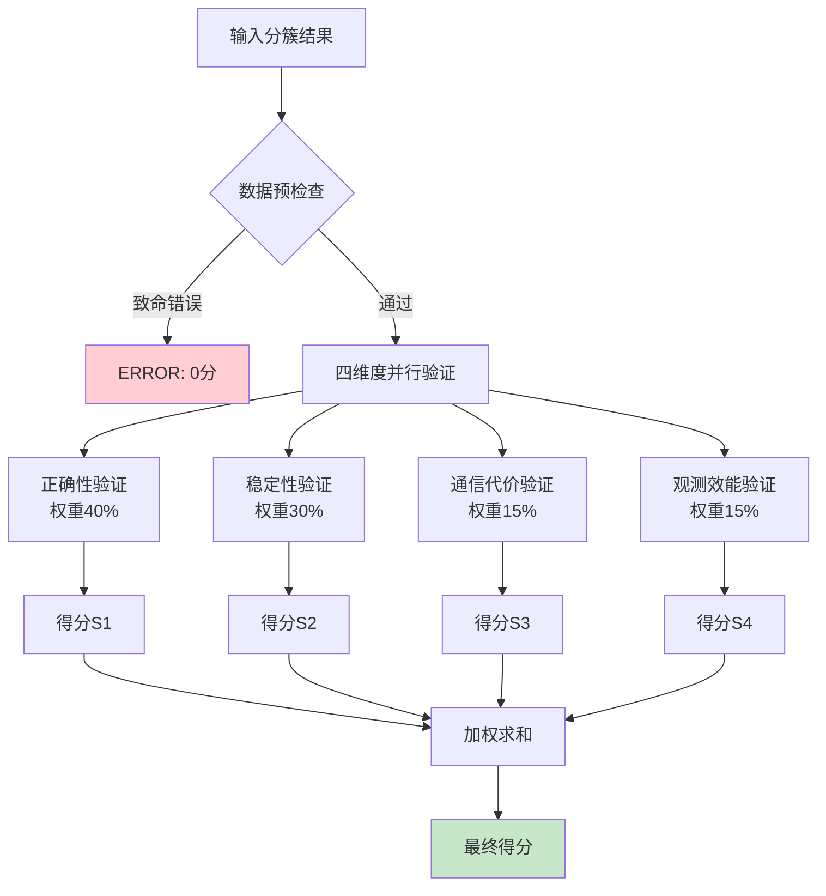

---

## 2. 详细验证项说明

### 2.1 正确性与隔离性验证 (Correctness and Isolation Validation)

正确性与隔离性验证构成了整个验证体系的基础框架，其40%的权重配置充分体现了该维度在质量保障中的核心地位。这一验证维度通过多层次的检查机制，从最基础的实体存在性验证开始，逐步深入到任务完整性和结构合理性的评估。

#### 2.1.1 验证流程架构总览

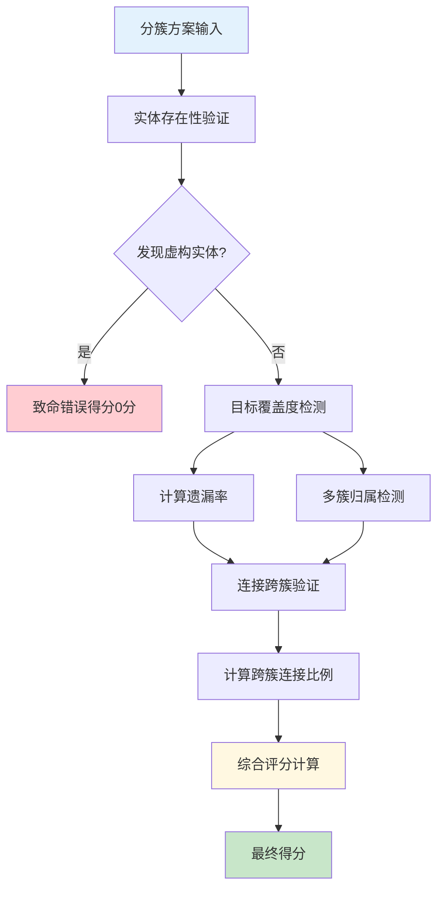

#### 2.1.2 核心验证维度概览表

| 验证项目 | 权重分配 | 检查目标 | 扣分策略 | 最大扣分 |
|---------|---------|----------|----------|----------|
| **实体存在性** | 致命项 | 虚构实体识别 | 一票否决制 | 100分（归零） |
| **目标覆盖度** | 50% | 任务完整性保障 | 线性比例扣分 | 50分 |
| **多簇归属** | 25% | 逻辑一致性检查 | 固定扣分制 | 25分 |
| **连接跨簇** | 25% | 结构合理性验证 | 比例化扣分 | 25分 |

#### 2.1.3 实体存在性验证机制

实体存在性验证占据着最为基础且关键的地位，体现了验证系统对大语言模型"幻觉"现象的零容忍态度。

**验证流程：**
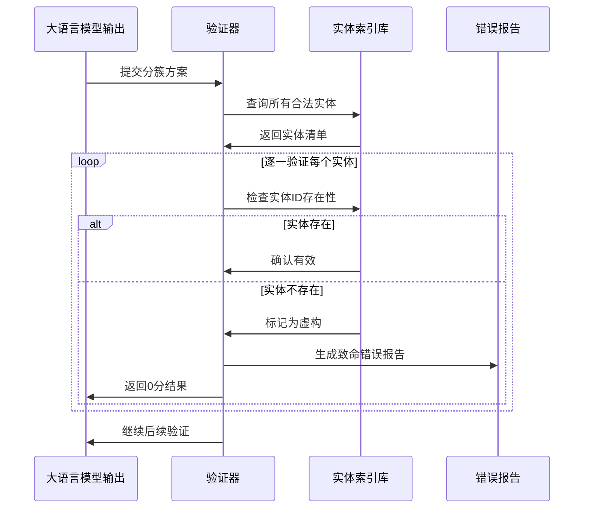

**检查范围：**
- ✅ 卫星ID合法性验证
- ✅ 目标ID真实性检查  
- ✅ 实体属性一致性确认
- ❌ 虚构实体立即拦截

#### 2.1.4 任务完整性验证系统

目标覆盖度检测通过量化的扣分机制来反映不同程度遗漏对整体任务质量的影响。

**评分公式：**
```
遗漏率 = 未分配目标数量 / 总目标数量
扣分 = min(50, 遗漏率 × 50)
```

**可视化示例：**
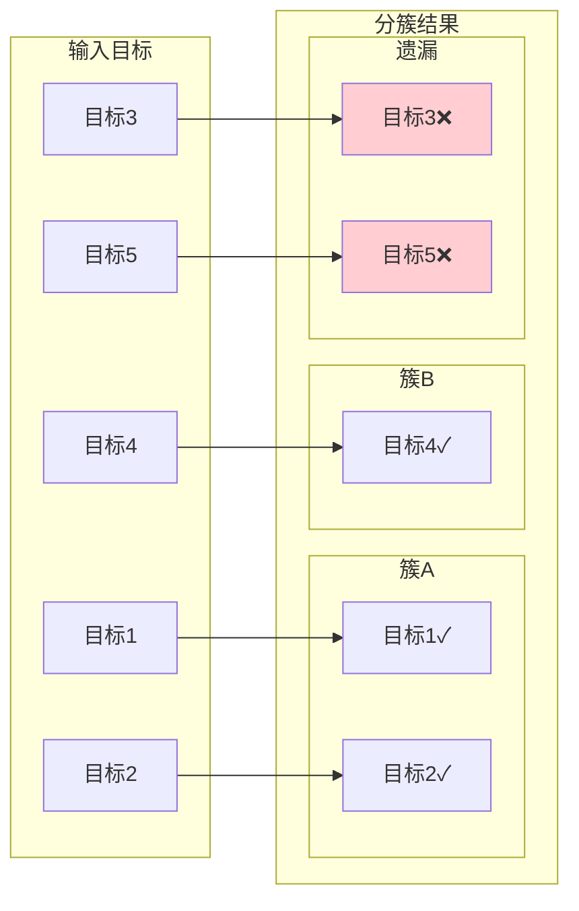

**扣分等级表：**

| 遗漏率范围 | 严重程度 | 扣分幅度 | 质量评价 |
|-----------|----------|----------|----------|
| 0% | 优秀 | 0分 | 任务完整 |
| 1%-10% | 良好 | 5-10分 | 轻微遗漏 |
| 11%-25% | 一般 | 11-25分 | 明显不足 |
| 26%-50% | 较差 | 26-50分 | 严重缺陷 |
| >50% | 极差 | 50分 | 任务失败 |

#### 2.1.5 结构隔离性验证深度分析

隔离性验证确保不同簇之间在逻辑上和物理上都保持清晰的边界，分为两个子项目：

**A. 多簇归属检测**

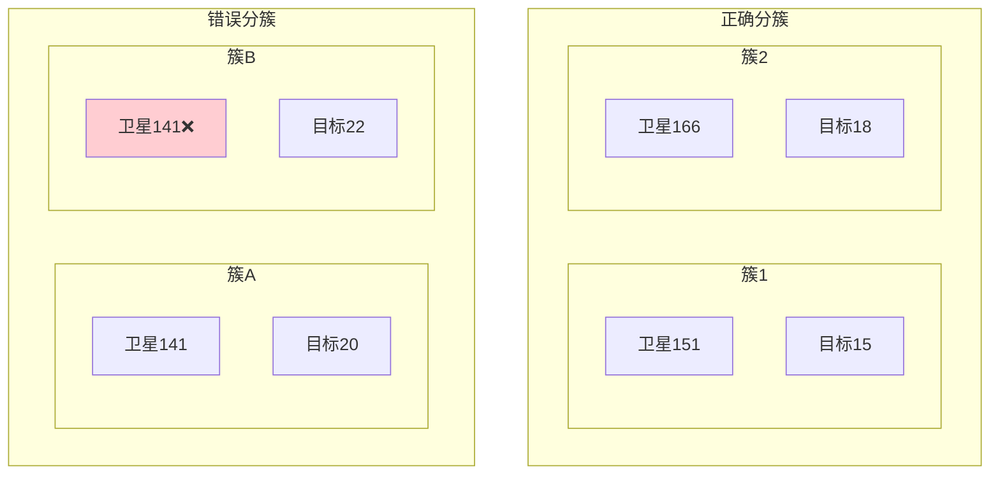

**B. 连接跨簇验证**

这一检查确保有效的观测连接不会被人为分割到不同的簇中：

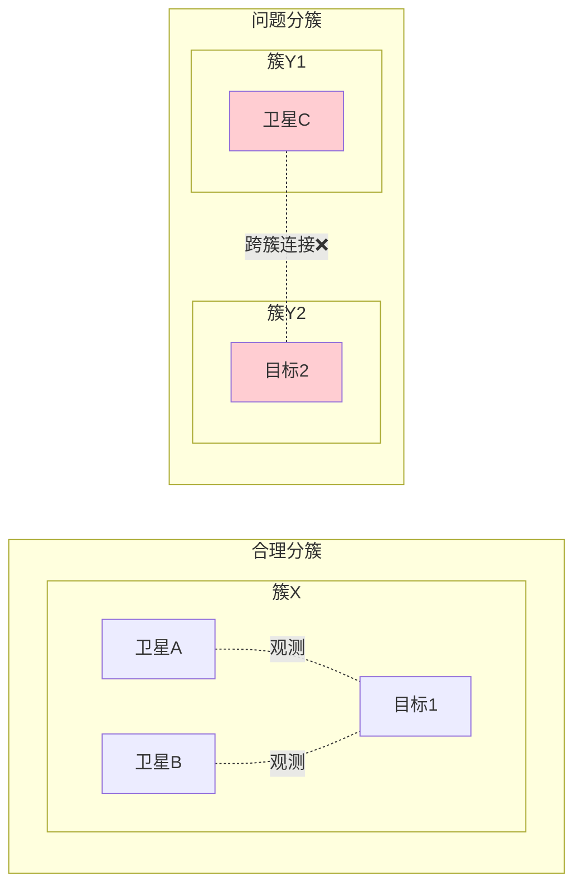

**连接验证算法流程：**

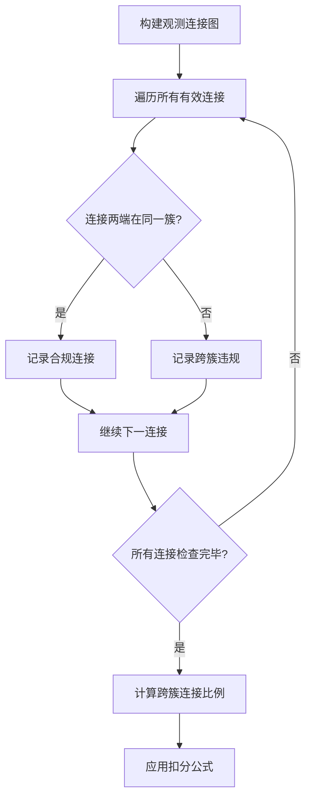

#### 2.1.6 综合评分机制

**评分计算公式：**
```
最终得分 = 100 - 目标覆盖扣分 - 多簇归属扣分 - 连接跨簇扣分
前提条件：无致命错误（否则直接为0分）
```

**评分区间分布：**

| 得分区间 | 质量等级 | 典型特征 | 改进建议 |
|---------|----------|----------|----------|
| 90-100分 | 优秀 | 全面覆盖，结构合理 | 保持现有质量 |
| 75-89分 | 良好 | 轻微缺陷，整体可用 | 优化细节问题 |
| 60-74分 | 合格 | 基本可用，有改进空间 | 重点解决主要问题 |
| 40-59分 | 不合格 | 明显缺陷，需要重构 | 全面优化算法 |
| 0-39分 | 极差 | 基础错误，无法使用 | 重新设计方案 |

##### 2.1.4.1 检查项目与评分标准

| 检查项目 | 最大扣分 | 检查内容 | 扣分策略 |
| :--- | :--- | :--- | :--- |
| **实体存在性验证** | 100分 | 虚构卫星/目标检测 | 一票否决制 |
| **目标覆盖度检测** | 50分 | 遗漏目标统计 | 按遗漏率线性扣分 |
| **多簇归属检测** | 25分 | 实体重复分配 | 按违规实体数量扣分 |
| **连接跨簇验证** | 25分 | 有效连接分割 | 按跨簇连接比例扣分 |

对于非致命性的质量问题，验证系统采用了渐进式的扣分策略。目标覆盖度检测的最大扣分限制为50分，隔离性验证的最大扣分限制同样为50分，两者在总分中的权重相等，体现了对任务完整性和结构合理性的均衡关注。在隔离性验证内部，多簇归属和连接跨簇各占25分的权重，这种平衡配置确保了对不同类型隔离性问题的公平评估。

扣分计算过程中的比例化设计是该评分机制的另一个重要特征。无论是目标遗漏率的计算还是跨簇连接比例的统计，验证系统都采用了相对比例而非绝对数量作为评分依据。这种设计使得验证结果不会因为任务规模的差异而产生偏差，确保了不同规模的分簇任务能够在同一标准下进行公正比较。

##### 2.1.4.2 正确性与隔离性验证流程图


#### 2.1.5 质量反馈机制与模型优化指导

正确性与隔离性验证不仅仅是一个评分过程，更是一个为大语言模型提供质量反馈和优化指导的智能系统。验证过程中产生的详细日志和错误报告为模型的后续改进提供了宝贵的信息资源。对于每一个检测到的问题，验证系统都会生成包含具体错误类型、涉及实体、错误位置等详细信息的诊断报告。

这种细粒度的反馈机制使得模型开发者能够快速定位问题的根源，并采取针对性的优化措施。例如，如果系统频繁检测到虚构实体问题，这可能表明模型在实体识别和引用方面存在系统性缺陷，需要通过改进训练数据或调整模型架构来解决。类似地，如果连接跨簇问题频繁出现，这可能表明模型对分簇逻辑的理解还不够深入，需要通过增强相关的训练样本来改善。

此外，验证系统还会生成统计性的质量分析报告，帮助开发者从宏观角度理解模型的性能特征。这些报告包括各类错误的出现频率、错误严重程度的分布、质量改善的趋势等信息，为模型的长期优化提供了科学的数据支撑。通过这种系统性的质量管理方法，正确性与隔离性验证不仅保障了单次分簇结果的质量，更为大语言模型在卫星分簇任务中的持续改进奠定了坚实基础。

---

### 2.2 分簇稳定性验证 (Cluster Stability Validation)

分簇稳定性验证代表着验证体系中最具创新性和技术挑战性的核心组件，其30%的权重配置体现了系统连续性在实际应用中的重要地位。这一验证维度的根本目标在于评估大语言模型生成的分簇方案在时间演进过程中的平滑过渡能力，确保分簇决策不会因为轻微的环境变化而产生剧烈的、不必要的调整。传统的稳定性评估方法往往过于简化，仅通过比较前后时间切片中实体的簇ID变化来判断稳定性，这种方法存在根本性的局限，无法准确区分有害的随机抖动和有益的自适应调整。

#### 2.2.1 基于连接关系的创新检测理念

本验证系统采用的核心创新在于摒弃了传统的簇ID比较方法，转而建立了基于连接关系的切换检测机制。这种方法的理论基础在于认识到簇ID的变化并不等同于实际工作关系的改变。在动态的卫星网络环境中，簇可能因为新成员的加入而重新编号，但簇内原有成员之间的协作关系可能并未发生实质性变化。因此，验证系统通过分析实体间"伙伴关系"的变化来准确识别真正的稳定性问题。

对于观测目标而言，其伙伴关系定义为与其在同一簇中且能够实际观测它的卫星集合。这种定义强调了功能性连接的重要性，即只有那些真正参与观测任务的卫星才被视为目标的有效伙伴。对于卫星实体，其伙伴关系则包括所有与其在同一簇中的其他卫星，这些卫星构成了其工作环境和协作网络。通过对比前后时间切片中这些伙伴关系的变化，验证系统能够准确识别哪些切换是基于合理需求的调整，哪些是无意义的抖动。

#### 2.2.1.1 连接关系变化的可视化分析

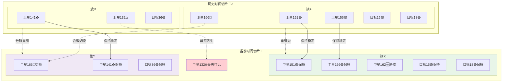

#### 2.2.2 目标稳定性验证的深度算法设计

目标稳定性验证作为稳定性评估的核心环节，承担着50分的最大评分权重，体现了对观测任务连续性的高度重视。该验证过程的算法设计体现了对复杂动态环境的深刻理解和精细化处理能力。验证系统首先会为每个目标构建其在历史时间切片中的伙伴卫星集合，然后获取其在当前时间切片中的伙伴卫星集合，同时识别当前时间切片中所有能够观测该目标的可见卫星。

关键的创新在于"丢失可见伙伴"的概念引入。系统会计算那些在历史时间切片中是目标伙伴、在当前时间切片中仍然可见、但却没有被分配给该目标的卫星数量。只有这些卫星的丢失才被认定为不合理的切换，因为它们代表着本可以继续提供观测服务却被不当移除的资源。这种精细化的区分机制有效避免了对合理调整行为的误判。

扣分策略采用了双因子设计，主要因子基于丢失的可见伙伴卫星数量，每个丢失的卫星导致5分的扣除；次要因子则基于目标切换率，反映切换频率对系统稳定性的影响。这种设计确保了对严重资源丢失的重点惩罚，同时也对频繁切换行为施加适当压力。

#### 2.2.2.1 目标稳定性验证流程优化

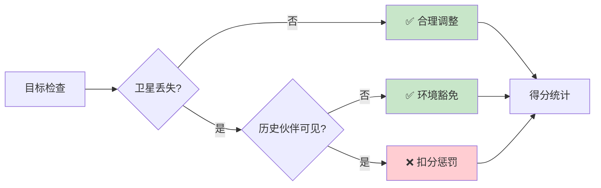

#### 2.2.3 卫星稳定性验证的网络拓扑感知

卫星稳定性验证在技术实现上更加复杂，因为它需要同时考虑卫星的伙伴关系变化和网络连通性约束。该验证过程的核心算法基于伙伴交集的计算，通过比较历史和当前的伙伴卫星集合来识别完全失去伙伴连接的情况。然而，简单的交集为空并不足以判定切换的不合理性，系统还需要进一步检查豁免条件。

网络孤岛检测是卫星稳定性验证的重要创新。当一颗卫星与其历史伙伴完全失去通信连接时，强制要求其保持原有的簇归属显然是不合理的。因此，验证系统会检查该卫星在当前时间切片中与历史伙伴的连通性状况，如果确认已形成孤岛，则将其切换行为归类为合理的网络自适应调整。

为避免重复惩罚的问题，验证系统建立了惩罚记录机制。如果某颗卫星已经在目标稳定性验证中因为其服务的目标发生不合理切换而被惩罚，那么在卫星稳定性验证中就会跳过对该卫星的重复处理。这种设计确保了评分的公正性和一致性。

#### 2.2.3.1 卫星稳定性验证的简化流程

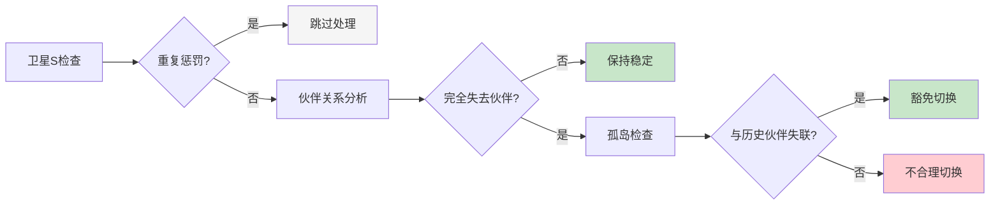

#### 2.2.4 Jaccard相似度的智能缩放机制

Jaccard相似度验证作为稳定性评估的补充维度，通过计算前后时间切片中簇成员的重叠程度来量化整体相似性。然而，简单的相似度阈值判断可能会对合理的系统调整产生误判。因此，验证系统引入了智能缩放机制，将Jaccard相似度的惩罚与实际检测到的不合理切换比例相关联。

当平均Jaccard相似度低于0.8的阈值时，系统不会立即施加惩罚，而是首先统计所有切换事件中不合理切换的比例。如果大部分切换都被前述的目标和卫星稳定性验证认定为合理调整，那么Jaccard相似度的惩罚就会被相应缩放甚至完全豁免。这种设计体现了验证系统的内在一致性和智能化特征。

#### 2.2.4.1 智能缩放决策流程

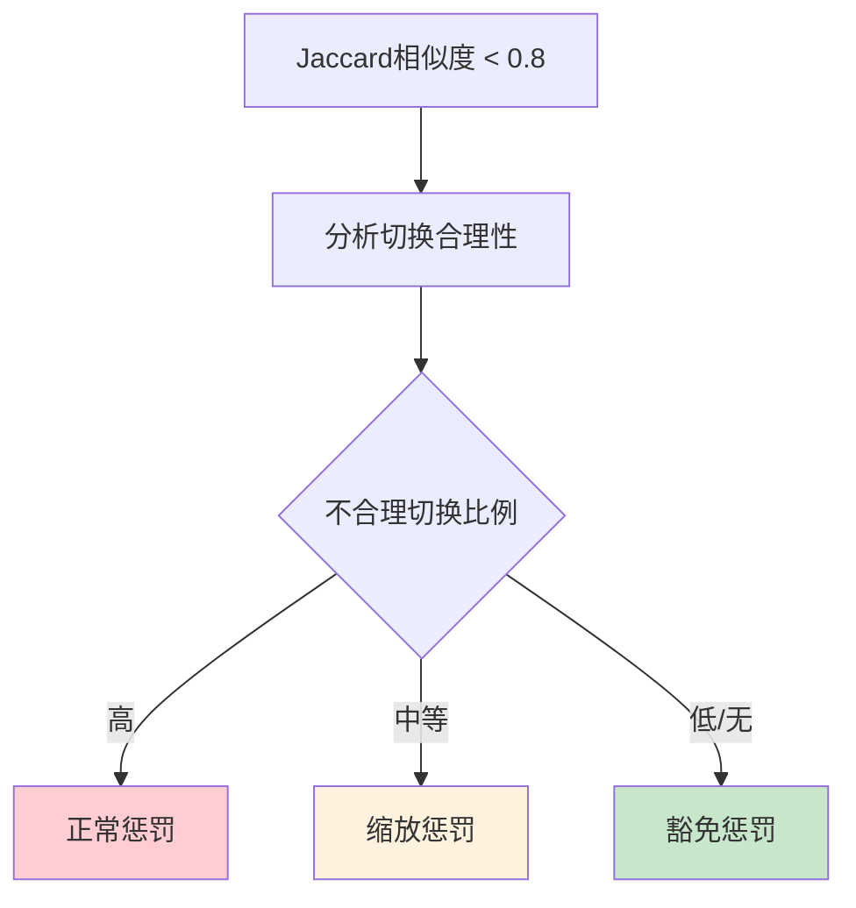

#### 2.2.5 豁免机制的语义理解与决策智能

稳定性验证系统的最大技术亮点在于其豁免机制所体现的语义理解能力。该机制能够智能区分"破坏性抖动"和"自适应调整"，这种区分需要对卫星分簇任务的深层逻辑有准确的理解。对于目标切换，系统基于物理可见性进行智能判断，完全豁免那些由于环境变化导致历史伙伴卫星完全不可见的切换，部分惩罚那些仍有可见卫星但被移除的情况。

对于卫星切换，系统则基于网络拓扑连通性进行分析，优先保证通信网络的完整性而非简单的成员稳定性。当卫星因为网络拓扑变化而成为孤岛时，其切换行为被理解为必要的网络重构，而非不稳定的表现。

通过建立详细的执行日志和可追溯的决策路径，验证系统确保每个豁免决策都有清晰的理由和依据。这种透明化的设计不仅提升了验证结果的可信度，也为大语言模型的持续优化提供了宝贵的学习信号。稳定性验证体系通过这种先进的语义级理解，实现了对分簇质量的精确评估，为大语言模型在复杂动态环境中的应用奠定了坚实的技术基础。

##### 1. 目标切换豁免机制

**豁免原则**: 基于物理可见性的智能判断
- **完全豁免**: 目标的历史伙伴卫星在当前时间切片中完全不可见
- **部分惩罚**: 仅对仍可见但被移除的伙伴卫星进行惩罚
- **合理调整识别**: 区分"移除不可见卫星+增加新卫星"与"移除可见卫星"

**实现细节**:
```python
# 筛选出在当前时间切片中仍然可见的历史伙伴卫星
still_visible_last_companions = last_companions & visible_sats_for_target

# 只有当存在"本来可见但被移除"的卫星时，才认为是不合理的切换
lost_visible_companions = still_visible_last_companions - current_companions

if len(lost_visible_companions) > 0:
    # 不合理切换，进行惩罚
else:
    # 合理调整，记录但不扣分
```

##### 2. 卫星切换豁免机制

**豁免原则**: 基于网络拓扑的连通性分析
- **孤岛豁免**: 卫星与原簇所有成员失去通信连接时，切换被豁免
- **网络完整性维护**: 优先保证通信网络的连通性而非简单的成员稳定性

**实现细节**:
```python
# 检查豁免条件：卫星是否在原簇已成孤岛
connected_sats = sat_connectivity.get(satellite, set())

# 如果卫星在当前时间切片，与旧伙伴卫星已无任何连接
if not last_companions.intersection(connected_sats):
    justified_satellite_switches += 1  # 豁免切换
    continue  # 跳过，不计入惩罚
```

##### 3. 重复惩罚避免机制

**问题**: 同一个切换事件可能在多个维度被重复惩罚
**解决方案**: 建立惩罚记录，确保同一卫星的同一次切换只被惩罚一次

```python
# 收集已经因为目标切换而被惩罚的卫星
satellites_penalized_for_targets = set()
for switch in target_switches:
    lost_sats = switch.get('lost_visible_companions', set())
    satellites_penalized_for_targets.update(lost_sats)

# 在卫星稳定性验证中跳过已惩罚的卫星
if satellite in satellites_penalized_for_targets:
    continue  # 跳过，避免重复惩罚
```

##### 4. Jaccard相似度的智能缩放

**创新设计**: Jaccard相似度惩罚与实际不合理切换的比例挂钩

```python
unjustified_switches = target_switch_count + satellite_switch_count
total_switches = unjustified_switches + justified_target_switches + justified_satellite_switches

if unjustified_switches > 0 and total_switches > 0:
    # 根据不合理切换的比例来缩放惩罚
    unjustified_ratio = unjustified_switches / total_switches
    jaccard_penalty = potential_jaccard_penalty * unjustified_ratio
elif unjustified_switches == 0:
    # 所有切换都是合理的，Jaccard惩罚完全豁免
    jaccard_penalty = 0
```

##### 4.1 智能缩放机制示意图


#### 2.2.4 信息记录与可解释性

验证系统提供详细的执行日志，确保每个决策都可追溯：

**调整信息记录**:
```
[INFO] 目标123簇调整：增加卫星{456, 789}, 移除不可见卫星{321}
[INFO] 卫星456簇调整：增加伙伴{789}, 移除伙伴{123}
```

**豁免信息记录**:
```
[INFO] 卫星456切换被豁免：与原伙伴卫星{123, 789}已无连接
[INFO] 卫星789切换不重复扣分：已在目标切换中惩罚
```

**警告信息记录**:
```
[WARNING] 目标切换2个，丢失3个可见伙伴，扣15.0分：目标123(丢失可见伙伴{456}); 目标789(丢失可见伙伴{321, 654})
```

通过这套先进的稳定性验证体系，我们实现了对分簇稳定性的**语义级理解**，能够准确区分有害的随意变动和有益的自适应调整，为大语言模型的分簇质量提供了更加精确和公正的评估。

#### 2.2.5 验证系统交互序列图

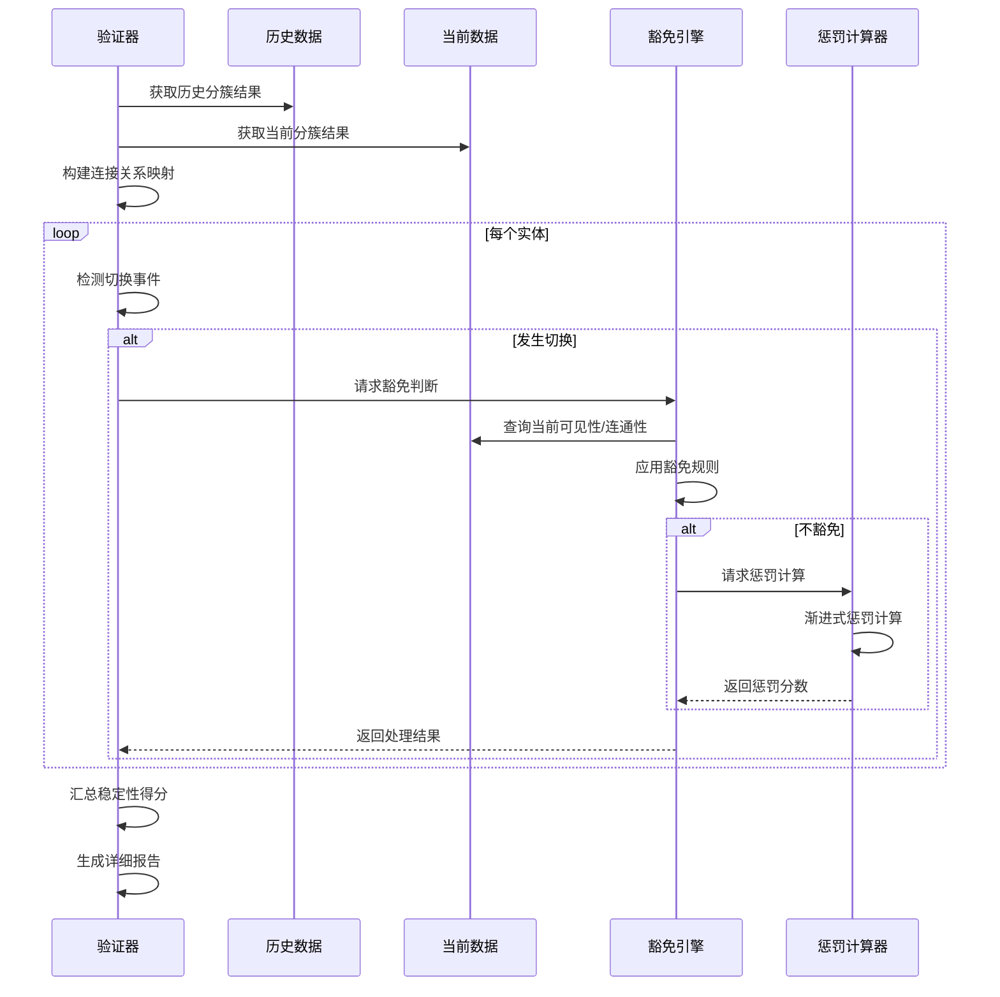

---

### 2.3 通信代价验证 (Communication Cost Validation)

通信代价验证作为验证体系中的重要技术维度，承担着15%的权重配置，其核心使命在于从网络效率的角度评估分簇方案的实用价值和经济合理性。该验证维度的设计理念基于这样一个重要认识：分簇的根本目的不仅仅是实现任务的分解和隔离，更重要的是通过合理的网络架构设计来显著降低系统的通信成本，提升整体的运行效率。在大规模卫星网络环境中，通信代价往往是制约系统性能的关键瓶颈，因此对分簇方案通信效率的精确评估具有重要的实践意义。

验证系统通过建立严格的双层检查机制来确保分簇方案在通信层面的可行性和优越性。第一层是基础可行性检查，专注于识别可能导致通信系统完全失效的致命错误；第二层是效率优化评估，通过量化分析来衡量分簇方案相对于基准情况的改进程度。这种分层设计既保证了对基本质量要求的严格把控，又为高级优化目标的实现提供了精确的量化依据。

#### 2.3.1 网络架构完整性的基础保障机制

通信代价验证的第一个关键环节是对网络架构完整性的严格检查，这一检查体现了验证系统对分簇方案基础可行性的零容忍标准。该检查过程的核心目标在于确保每个分簇都具备基本的通信能力，能够支撑起簇内协调和簇间同步的双重任务需求。验证系统首先会对每个簇的主节点配置进行详细审查，确保主节点不仅被正确指定，更重要的是确保指定的主节点确实是该簇的合法成员。

主节点的有效性检查体现了验证系统对分簇逻辑完整性的深度关注。主节点作为簇的控制核心和对外通信的唯一接口，其身份的合法性直接决定了整个簇的功能完整性。如果一个簇的主节点被错误地指定为其他簇的成员或者完全虚构的实体，那么该簇在实际运行中将无法进行有效的内部管理和外部协调，从而导致整个分簇方案的失效。验证系统通过建立严格的成员资格映射机制来检测这类错误，一旦发现主节点身份异常，立即触发致命错误处理流程。

网络连通性验证则代表了对分簇内部通信拓扑的深度分析。该验证过程需要处理复杂的图论问题，通过构建簇内通信网络的拓扑图，并运行连通性分析算法来确定每个成员卫星是否都能通过可靠的通信路径与主节点保持联系。这种检查不仅要考虑直接的通信链路，还要分析多跳路径的可达性，确保即使在某些直接链路临时中断的情况下，簇内通信仍能保持基本的可靠性。

当验证系统检测到网络中存在无法与主节点通信的"孤星"卫星时，会立即认定该分簇方案存在致命的架构缺陷。这种严厉的处理方式体现了对通信完整性要求的不妥协态度，因为孤星的存在意味着分簇方案在物理上是不完整的，无法实现预期的协调效果。在这种情况下，该维度的得分会被直接置为零分，向大语言模型传递明确的错误信号。

#### 2.3.1.1 网络完整性验证的技术架构

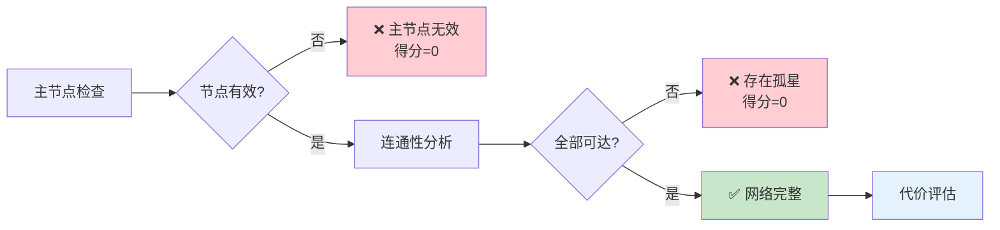

#### 2.3.2 分层通信代价的精确计算与优化评估

当分簇方案通过基础完整性检查后，验证系统会启动精密的通信代价计算流程，这一流程体现了对网络效率优化的系统性评估方法。通信代价的计算基于对分簇网络双层架构的深刻理解：簇内同步代表了微观层面的协调效率，而簇间同步则体现了宏观层面的全局一致性维护成本。这种分层设计既反映了分簇网络的实际运行模式，也为代价优化提供了清晰的分析框架。

簇内同步代价的计算过程体现了验证系统对局部网络效率的精细化分析。该计算需要首先建立每个簇的完整通信拓扑图，然后运行最短路径算法来确定每个成员卫星到主节点的最优通信路径。验证系统采用了Dijkstra算法的优化实现，能够高效处理具有数百个节点的复杂网络拓扑。对于每个簇，系统会计算所有成员到主节点的最短路径距离之和，这个数值直接反映了该簇维持内部同步所需的通信成本。

全网同步代价的计算则聚焦于分簇方案在宏观层面的协调效率。该计算基于这样的假设：簇间的信息同步主要通过主节点之间的直接通信来实现，因此主节点间的通信代价直接决定了全网同步的效率。验证系统会构建一个以所有主节点为顶点的完全图，并计算该图中所有节点对之间的最短路径距离之和。这种计算方式确保了对最坏情况通信需求的全面覆盖。

基准代价的计算代表了验证系统的创新设计，通过建立"未分簇"情况下的通信成本基线，为分簇效果的量化评估提供了科学的参考标准。在基准情况下，系统假设所有卫星都需要与网络中的所有其他卫星保持直接同步，因此基准代价等于全网所有卫星对之间最短路径距离的总和。这种计算虽然在实际中可能不会完全发生，但它为评估分簇方案的相对优势提供了一个统一的度量标准。

#### 2.3.2.1 代价计算的数学模型与算法实现

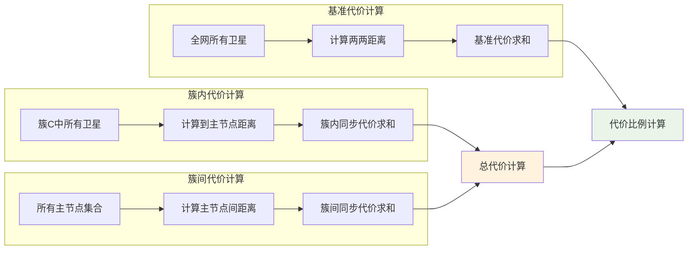

#### 2.3.3 效率提升的量化评估与评分策略

通信代价验证的评分策略体现了对分簇效果量化评估的科学方法。该策略的核心思想在于通过比较分簇后的实际通信代价与基准代价的比值来衡量分簇方案的网络效率改进程度。这种相对比较的方法有效避免了因网络规模差异而导致的评估偏差，确保了评估结果的公正性和可比性。

验证系统建立了基于代价比例的渐进式评分机制，该机制能够精确反映不同程度的效率改进对总体质量的贡献。当代价比例低于10%的理想阈值时，验证系统认为分簇方案实现了显著的通信效率提升，给予满分奖励。这个阈值的设定基于对实际卫星网络通信特征的深入分析，代表了在当前技术条件下可以期望达到的优秀水平。

对于代价比例超过理想阈值的情况，验证系统采用了平滑的线性扣分策略。扣分幅度与代价比例成正比关系，最大扣分限制为100分，确保了即使是效率提升有限的分簇方案也不会受到过度惩罚。这种设计鼓励大语言模型持续优化分簇策略，同时也为渐进式的性能改进提供了合理的奖励机制。

评分策略的另一个重要特征是其对极端情况的处理能力。当分簇方案的通信代价甚至超过基准情况时，验证系统会施加相应的重度惩罚，明确向模型传达"分簇不当反而有害"的质量信号。这种处理方式确保了验证系统能够有效识别和惩罚那些徒有分簇之名却无分簇之实的低质量方案。

#### 2.3.3.1 评分策略的精确实现

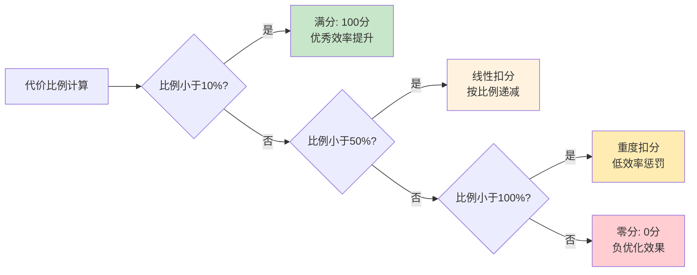

#### 2.3.4 网络拓扑感知的智能化评估机制

通信代价验证系统的一个重要创新在于其网络拓扑感知能力，该能力使得验证过程能够适应不同的网络环境和拓扑特征。验证系统不仅考虑静态的距离计算，还会分析网络拓扑的动态特性，如链路稳定性、带宽限制、延迟特征等因素对通信代价的影响。这种综合性的分析方法确保了验证结果能够更准确地反映实际应用中的网络性能。

系统还建立了自适应的阈值调整机制，能够根据网络规模和拓扑复杂度自动调整评分标准。对于大规模、高复杂度的网络，系统会适当放宽理想阈值的要求，承认在复杂环境中实现极高效率提升的困难性。相反，对于小规模、简单拓扑的网络，系统会提高效率要求，鼓励模型充分利用网络的简单性来实现更好的优化效果。

通过建立详细的性能分析报告和可视化的代价分解图表，验证系统为模型优化提供了丰富的反馈信息。这些报告不仅包含总体的评分结果，还提供了簇级别的代价分析、主节点选择的合理性评估、网络瓶颈的识别等详细信息，为模型的针对性改进指明了具体方向。

#### 2.3.4.1 智能评估流程优化图

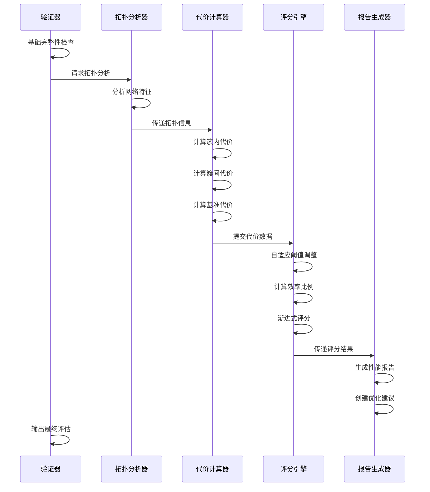

通过这套完整的通信代价验证体系，验证系统实现了对分簇方案网络效率的精确量化评估，不仅确保了分簇方案在通信层面的基础可行性，更为网络效率的持续优化提供了科学的评估标准和改进指导。该验证维度的创新设计为大语言模型在复杂网络环境中的应用奠定了坚实的技术基础。

---

### 2.4 观测效能验证：任务导向的可靠性保障体系

观测效能验证作为验证体系中的重要技术维度，承担着15%的权重配置，其核心使命在于从任务完成质量的角度评估分簇方案的实用价值和可靠性水平。该验证维度基于卫星观测系统的本质特征，建立了科学严谨的质量评估框架。

#### 2.4.1 验证架构与核心指标体系

**观测效能验证框架总览**

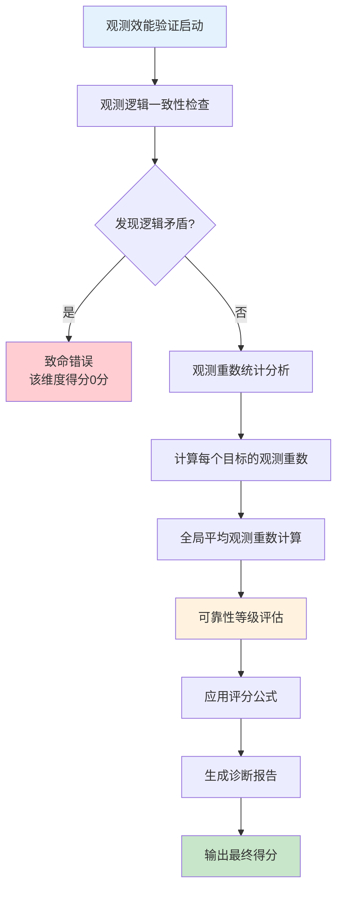

**核心技术指标定义表**

| 技术指标 | 定义描述 | 计算公式 | 理想范围 | 质量意义 |
|---------|---------|----------|----------|----------|
| **观测重数** | 单个目标被观测的卫星数量 | R(T) = \|{S: S能观测T}\| | ≥2.0 | 单点容错能力 |
| **平均观测重数** | 全部目标观测重数的算术平均 | AR = Σ R(Ti) / N | ≥2.5 | 系统整体可靠性 |
| **观测覆盖率** | 具备观测能力目标的比例 | CR = 有效目标数 / 总目标数 | 100% | 任务完整性 |
| **冗余系数** | 超出基本需求的观测能力 | RC = (AR - 1.0) / 1.5 | ≥1.0 | 抗干扰水平 |

#### 2.4.2 致命错误检测的逻辑验证机制

致命错误检测代表着观测效能验证的基础质量保障环节，其核心任务在于识别和处理最严重的逻辑矛盾：目标被分配给无法观测它的簇。

**逻辑一致性验证算法流程**

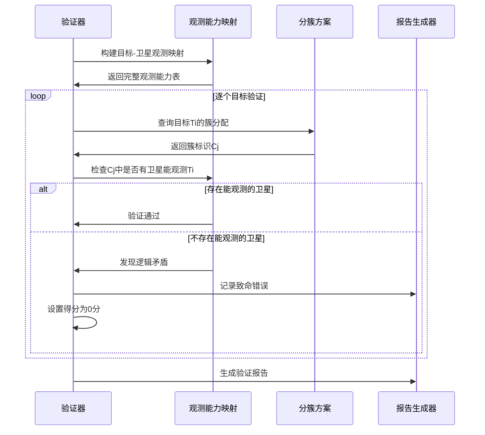

**逻辑矛盾检测案例分析**

```mermaid
graph TB
    subgraph 正确配置["✅ 正确的观测分配"]
        subgraph 簇A["簇A"]
            S1[卫星151] --> T1[目标15]
            S2[卫星166] --> T1
            S1 --> T2[目标18]
        end
    end
    
    subgraph 错误配置["❌ 逻辑矛盾配置"]
        subgraph 簇B["簇B"]
            S3[卫星141]
            T3[目标20]
        end
        S3 -.×无法观测.-> T3
    end
    
    style 错误配置 fill:#ffebee
    style T3 fill:#ffcdd2
```

**致命错误类型与处理机制**

| 错误类型 | 具体表现 | 检测方法 | 处理策略 | 影响程度 |
|---------|----------|----------|----------|----------|
| **观测能力缺失** | 目标分配给无观测能力的簇 | 能力映射匹配 | 立即置0分 | 任务完全失效 |
| **空簇分配** | 目标分配给不存在的簇 | 簇标识验证 | 立即置0分 | 系统结构错误 |
| **循环依赖** | 观测关系形成闭环 | 图论算法检测 | 立即置0分 | 逻辑自相矛盾 |

#### 2.4.3 观测重数的量化评估与可靠性分析

观测重数评估作为观测效能验证的核心技术组件，通过对每个目标观测冗余度的精确量化来评估分簇方案的整体可靠性水平。

**观测重数分布分析框架**

```mermaid
graph LR
    subgraph 观测重数统计
        A[原始分簇方案] --> B[构建观测矩阵]
        B --> C[计算各目标重数]
        C --> D[统计分布特征]
    end
    
    subgraph 可靠性评估
        D --> E[平均重数计算]
        E --> F[标准差分析]
        F --> G[可靠性等级判定]
    end
    
    subgraph 质量评分
        G --> H[应用评分公式]
        H --> I[生成改进建议]
        I --> J[输出综合报告]
    end
    
    style 观测重数统计 fill:#e3f2fd
    style 可靠性评估 fill:#f3e5f5
    style 质量评分 fill:#e8f5e8
```

**可靠性等级分类标准**

| 可靠性等级 | 平均观测重数范围 | 得分系数 | 系统特征 | 适用场景 |
|-----------|-----------------|----------|----------|----------|
| **卓越级** | ≥3.0 | 1.0 | 高冗余，强容错 | 关键任务系统 |
| **优秀级** | 2.5-2.99 | 1.0 | 充分冗余，可靠稳定 | 标准业务应用 |
| **良好级** | 2.0-2.49 | 0.8-1.0 | 基本冗余，一般可靠 | 常规观测任务 |
| **合格级** | 1.5-1.99 | 0.4-0.79 | 有限冗余，基础可用 | 非关键应用 |
| **临界级** | 1.0-1.49 | 0.01-0.39 | 无冗余，存在风险 | 应急备用模式 |
| **不合格** | <1.0 | 0.0 | 覆盖不足，无法使用 | 需要重新设计 |

**评分公式与数学模型**

观测效能得分计算采用分段线性函数：

```
当AR ≥ 2.5时：Score = 100分（满分）
当1.0 ≤ AR < 2.5时：Score = (AR - 1.0) / 1.5 × 100分
当AR < 1.0时：Score = 0分（不合格）

其中：AR = 平均观测重数 = Σ[观测重数(目标i)] / 目标总数
```

**观测重数分布可视化示例**

```mermaid
graph TB
    subgraph 高质量分簇方案
        subgraph 目标观测重数分布
            T1["目标1: 3个卫星"]
            T2["目标2: 4个卫星"] 
            T3["目标3: 2个卫星"]
            T4["目标4: 3个卫星"]
        end
        AR1["平均重数: 3.0<br/>得分: 100分"]
    end
    
    subgraph 中等质量分簇方案  
        subgraph 目标观测重数分布2
            T5["目标1: 2个卫星"]
            T6["目标2: 1个卫星"]
            T7["目标3: 2个卫星"] 
            T8["目标4: 3个卫星"]
        end
        AR2["平均重数: 2.0<br/>得分: 67分"]
    end
    
    subgraph 低质量分簇方案
        subgraph 目标观测重数分布3
            T9["目标1: 1个卫星"]
            T10["目标2: 0个卫星❌"]
            T11["目标3: 1个卫星"]
            T12["目标4: 1个卫星"]
        end
        AR3["存在致命错误<br/>得分: 0分"]
    end
    
    style AR1 fill:#c8e6c9
    style AR2 fill:#fff3e0  
    style AR3 fill:#ffcdd2
```

#### 2.4.4 系统可靠性的多维度分析框架

**可靠性分析的技术指标体系**

除了平均观测重数这一核心指标外，验证系统还建立了多维度的可靠性分析框架：

```mermaid
mindmap
  root((观测可靠性))
    基础可靠性
      观测覆盖完整性
      最小重数保障
      空白区域识别
    冗余可靠性  
      重数分布均匀性
      备份能力充足性
      故障恢复能力
    动态可靠性
      负载均衡程度
      扩展适应能力
      实时调整潜力
    系统可靠性
      整体协调性
      资源利用效率
      任务完成保障
```

**可靠性评估的统计学方法**

| 统计指标 | 计算方法 | 意义解释 | 目标值 |
|---------|----------|----------|--------|
| **均值** | μ = Σxi / n | 整体观测重数水平 | ≥2.5 |
| **标准差** | σ = √[Σ(xi-μ)²/n] | 重数分布均匀程度 | <1.0 |
| **变异系数** | CV = σ/μ | 相对离散程度 | <0.4 |
| **最小值** | min{xi} | 系统薄弱环节 | ≥1.0 |
| **分位数** | Q1, Q2, Q3 | 分布形态特征 | Q1≥2.0 |

#### 2.4.5 质量优化指导与改进建议生成

**智能诊断与建议生成机制**

```mermaid
flowchart LR
    A[观测重数分析结果] --> B{平均重数<2.5?}
    B -->|是| C[生成冗余增强建议]
    B -->|否| D{分布不均匀?}
    
    C --> C1[增加卫星观测能力]
    C --> C2[优化目标-卫星匹配]
    C --> C3[调整簇规模配置]
    
    D -->|是| E[生成均衡优化建议]
    D -->|否| F[生成维护建议]
    
    E --> E1[重新分配观测任务]
    E --> E2[调整簇间资源配置]
    E --> E3[优化负载均衡策略]
    
    F --> F1[保持当前配置]
    F --> F2[定期监控评估]
    F --> F3[准备应急预案]
    
    style C fill:#ffecb3
    style E fill:#e1f5fe  
    style F fill:#e8f5e8
```

**分级改进策略表**

| 问题严重程度 | 诊断标准 | 主要改进策略 | 预期效果 | 实施优先级 |
|-------------|----------|-------------|----------|------------|
| **极高** | AR<1.0或存在致命错误 | 全面重构分簇方案 | 基础可用性恢复 | 立即执行 |
| **高** | 1.0≤AR<1.5 | 增强观测冗余配置 | 可靠性显著提升 | 高优先级 |
| **中** | 1.5≤AR<2.0 | 优化资源分配策略 | 性能稳步改善 | 中优先级 |
| **低** | 2.0≤AR<2.5 | 微调均衡性调整 | 效率小幅优化 | 低优先级 |
| **无** | AR≥2.5 | 维持现状并监控 | 稳定运行保障 | 例行维护 |

通过这套完整的观测效能验证体系，验证系统能够对分簇方案的任务完成能力进行全面、准确的评估，为大语言模型的持续优化提供科学可靠的质量反馈和改进指导。该体系不仅确保了观测任务的基础可靠性，更为系统的长期稳定运行和性能提升奠定了坚实基础。 2.4.3 观测效能评估流程图

```mermaid
graph LR
    A[目标遍历] --> B[簇内观测检查]
    B --> C{观测逻辑正确?}
    C -->|否| D[❌ 0分]
    C -->|是| E[计算观测重数]
    E --> F[全局平均重数]
    F --> G{重数评级}
    G -->|优秀≥2.5| H[✅ 100分]
    G -->|不及格≤1.0| I[❌ 0分]
    G -->|一般| J[线性插值]
    
    style D fill:#ffcccc
    style H fill:#ccffcc
    style I fill:#ffcccc
    style J fill:#ffffcc
```

通过这套完整的观测效能验证体系，验证系统建立了对分簇方案任务完成能力的全面评估机制，既确保了基本逻辑的正确性，又量化了系统的可靠性水平，为大语言模型在观测任务理解和可靠性设计方面的能力提升提供了明确的指导方向。

---

## 3. 致命错误验证：质量底线的严格保障机制

在精细化的四维评估体系之上，验证器建立了一套基于"一票否决"原则的致命错误检测机制，该机制代表着验证系统对分簇方案基础质量要求的绝对底线。这种设计理念体现了对实际应用场景的深刻理解：在复杂的卫星系统中，某些类型的错误具有灾难性的后果，任何一个致命错误的存在都可能导致整个分簇方案在实际部署中的完全失效，因此必须采用最严格的标准来识别和处理这些错误。

### 3.1 致命错误分类与影响机制

| 错误类型 | 检测维度 | 触发条件 | 影响范围 | 严重程度 |
| :--- | :--- | :--- | :--- | :--- |
| **实体存在性错误** | 正确性验证 | 发现虚构卫星/目标 | 整个正确性维度 | 极高 - 一票否决 |
| **历史数据完整性错误** | 稳定性验证 | 缺失历史时间切片 | 整个稳定性维度 | 极高 - 一票否决 |
| **网络架构完整性错误** | 通信代价验证 | 主节点无效/孤星存在 | 整个通信维度 | 极高 - 一票否决 |
| **观测逻辑一致性错误** | 观测效能验证 | 目标分配给无观测能力的簇 | 整个观测维度 | 极高 - 一票否决 |

致命错误机制的核心价值在于建立了一个清晰的质量分层体系，明确区分了"不可容忍的根本性缺陷"与"可以接受的性能不足"。这种分层处理方式不仅确保了验证系统的科学性和合理性，更为大语言模型的学习过程提供了明确的质量标准和优化方向。任何致命错误的触发都会导致相应验证维度的得分直接归零，从而对总分产生重大影响，这种严厉的惩罚机制有效促使模型首先掌握最基本的规则遵循能力，然后再在高级优化目标上进行精进。

### 3.1 致命错误的系统性分类与检测架构

验证系统将致命错误划分为四个主要类别，每个类别都对应着分簇任务中的关键质量要素，这种分类体系确保了对所有可能导致系统失效的根本性问题的全面覆盖。实体存在性错误代表着对模型基础认知能力的检验，历史数据完整性错误体现了对系统连续性要求的严格执行，网络架构完整性错误反映了对通信可行性的底线保障，而观测逻辑一致性错误则确保了任务执行的基础合理性。

每种致命错误都配备了专门的检测算法和处理流程，这些算法在设计上追求极高的准确性和可靠性，避免误判的发生。检测过程采用了多重验证机制，对于每一个潜在的致命错误，系统都会进行反复确认，只有在绝对确定存在问题的情况下才会触发致命错误处理。这种谨慎的处理方式既保证了错误检测的准确性，也避免了因为误判而对模型造成不公正的惩罚。

#### 3.1.1 致命错误检测的技术架构与处理流程

```mermaid
flowchart LR
    subgraph "并行检测机制"
        A[输入验证] --> B1[实体存在性检测]
        A --> B2[历史数据完整性检测]
        A --> B3[网络架构完整性检测] 
        A --> B4[观测逻辑一致性检测]
    end
    
    subgraph "错误聚合与影响评估"
        B1 --> C[致命错误聚合器]
        B2 --> C
        B3 --> C
        B4 --> C
    end
    
    subgraph "分维度影响处理"
        C --> D1[正确性维度: 实体错误扣至0分]
        C --> D2[稳定性维度: 历史错误扣至0分]
        C --> D3[通信维度: 网络错误扣至0分]
        C --> D4[观测维度: 逻辑错误扣至0分]
    end
    
    style C fill:#fff3e0
    style D1 fill:#ffcdd2
    style D2 fill:#ffcdd2
    style D3 fill:#ffcdd2
    style D4 fill:#ffcdd2
```

### 3.2 实体存在性验证：对模型认知真实性的根本考验

实体存在性验证作为致命错误检测的首要环节，承担着对大语言模型基础认知能力进行根本性检验的重要使命。该验证过程的核心理念在于确保模型对输入数据的理解和引用都建立在真实、准确的基础之上，任何脱离现实数据的虚构或臆测都被视为不可接受的严重缺陷。这种严格的真实性要求体现了验证系统对实际应用场景的深度考虑：在卫星系统的实际部署中，任何虚构的实体引用都可能导致控制指令的错误发送和系统故障的发生。

验证算法通过建立完整的实体索引机制来实现高效而准确的存在性检查。系统首先会构建当前时间切片中所有合法实体的哈希表，包括卫星标识符、目标编号、以及相关的属性信息，然后对分簇方案中提及的每一个实体进行逐一验证。这种基于哈希表的查找机制不仅保证了检查的高效性，更确保了验证结果的绝对准确性。

当检测到任何虚构实体时，验证系统会立即激活致命错误处理机制，不仅将正确性与隔离性维度的得分置为零分，还会生成详细的错误诊断报告，明确指出问题实体的具体信息和出现位置。这种精确的错误定位能力为模型的后续改进提供了宝贵的反馈信息，帮助开发者快速识别和修正模型在实体理解方面的系统性问题。

### 3.3 历史数据完整性验证：时间连续性的基础保障

历史数据完整性验证体现了验证系统对分簇稳定性评估科学性的严格要求。稳定性作为一个基于时间序列的评估维度，其评估过程必须依赖于历史数据的支撑才能进行有意义的分析。当历史数据缺失时，稳定性验证失去了比较的基准，无法产生任何有价值的评估结果，因此必须被识别为致命错误。

该验证过程不仅检查历史数据的存在性，还会对历史数据的完整性和一致性进行深度验证。系统会检查历史分簇方案的数据结构是否完整，实体标识是否一致，时间戳是否正确等关键信息。这种全面的完整性检查确保了稳定性评估的可靠性和准确性，避免了因为数据质量问题而导致的错误评估。

当历史数据完整性验证失败时，验证系统会将分簇稳定性维度的得分直接置为零分，并在错误报告中明确说明数据缺失的具体情况。这种处理方式虽然严格，但对于保证验证结果的科学性和可信度具有重要意义，同时也提醒开发者注意数据准备环节的质量控制。

### 3.4 网络架构完整性验证：通信可行性的技术保障

网络架构完整性验证代表着验证系统对分簇方案物理可行性的基础要求。该验证过程涉及两个关键检查项目：主节点配置的合法性和簇内网络的连通性，这两个要素共同构成了分簇方案在通信层面的可执行性基础。任何一个要素的缺失都会导致整个分簇在实际部署中的功能失效。

主节点合法性检查确保每个簇的控制核心都被正确指定且具备相应的权限。验证算法会检查每个指定的主节点是否确实属于相应的簇，是否具备承担主节点职责的技术能力，以及是否与其他主节点存在冲突。这种多层次的验证机制确保了主节点配置的科学性和可靠性。

连通性验证则通过图论算法来检查簇内通信网络的完整性。系统会构建簇内的通信拓扑图，运行连通性分析算法来识别是否存在无法与主节点通信的孤立节点。这种基于图论的分析方法不仅能够准确识别连通性问题，还能提供关于网络结构优化的有价值信息。

### 3.5 观测逻辑一致性验证：任务执行的合理性检查

观测逻辑一致性验证作为致命错误检测的最后一道防线，专注于确保分簇方案在任务执行层面的基础合理性。该验证的核心理念在于检查每个观测任务的分配是否建立在坚实的物理基础之上，避免出现"纸上谈兵"式的无效分配。

验证算法通过构建观测能力映射来实现精确的逻辑一致性检查。系统会为每个目标建立其可观测卫星的集合，然后检查该目标所分配的簇是否包含至少一颗具备观测能力的卫星。这种基于能力映射的验证方法确保了检查的准确性和可靠性。

当检测到观测逻辑矛盾时，验证系统会将观测效能维度的得分置为零分，并生成包含具体问题目标和相关簇信息的详细错误报告。这种精确的问题定位能力帮助开发者快速识别和修正模型在观测任务理解方面的缺陷。

### 3.5.1 观测逻辑验证的深度检查机制

```mermaid
graph LR
    A[目标分析] --> B[能力检查]
    B --> C{逻辑一致?}
    C -->|否| D[❌ 逻辑矛盾<br/>得分=0]
    C -->|是| E[✅ 验证通过]
    D --> F[错误报告]
    F --> G[改进建议]
    
    style D fill:#ffcdd2
    style E fill:#c8e6c9
    style F fill:#fff3e0
    style G fill:#e3f2fd
```

通过这套完整的致命错误验证体系，验证系统建立了对分簇方案基础质量的严格保障机制，确保只有那些在根本逻辑上正确、在技术上可行的分簇方案才能通过基础质量检查，进入到后续的精细化评估阶段。这种分层验证的设计理念不仅提升了验证结果的可靠性，更为大语言模型的质量改进提供了明确的方向和标准。

---
## 4. 综合评估与统计分析引擎：智能化性能诊断体系

验证器的综合评估与统计分析引擎代表着验证体系的高级智能化特征，该引擎不仅具备对单个分簇结果进行精确验证的能力，更重要的是能够对整个验证数据集进行系统性的统计分析和深度挖掘，从宏观视角为大语言模型性能的全面理解和针对性优化提供科学依据。这一创新设计将传统的"验证-评分"模式提升为"验证-分析-诊断-指导"的全流程智能化管理体系，显著提升了验证系统的实用价值和指导意义。

该引擎的核心价值在于实现了从个体评估到群体分析的跨越，通过对大量验证样本的统计分析，能够识别出模型性能的深层次规律和系统性特征。这种宏观分析能力使得开发者不仅能够了解模型在具体样本上的表现，更能够从统计学角度理解模型的整体能力水平、稳定性特征、以及主要的性能瓶颈所在，为模型的系统性改进提供了科学的数据支撑和明确的优化方向。

### 4.1 多维度分析功能的系统性设计与实现

综合评估引擎通过四个核心分析功能的有机结合，构建了一个全面而深入的性能分析体系。宏观性能快照功能提供了对模型整体性能水平的直观认知，分数分布分析功能揭示了模型性能的一致性和稳定性特征，多维度能力剖析功能识别了模型的优势领域和薄弱环节，而根本原因分析功能则深入到具体的错误类型层面，为问题的精确定位和针对性解决提供了详细的指导信息。

#### 4.1.1 宏观性能快照：整体能力水平的量化呈现

宏观性能快照作为分析引擎的基础功能，通过自动化的统计计算为开发者提供了对模型整体性能水平的直观认知。该功能不仅计算传统的平均分指标，还引入了最高分、最低分、满分率、标准差等多元化的统计指标，形成了一个全面而立体的性能描述体系。这种多指标的设计确保了对模型性能特征的准确把握，避免了单一指标可能导致的片面认知。

平均分指标虽然提供了整体性能水平的基本认知，但验证引擎更注重对性能分布特征的深度分析。最高分和最低分的对比揭示了模型性能的波动范围，标准差则量化了性能的稳定性程度，而满分率指标则直接反映了模型达到理想状态的频率。这些指标的综合分析为模型性能的全面评估提供了科学的数据基础。

#### 4.1.2 分数分布分析：性能一致性的深度解读

分数分布分析功能通过构建详细的分数区间统计，为模型性能一致性的评估提供了科学的分析方法。该功能将所有验证样本的得分按照预定义的区间进行分类统计，不仅计算每个区间的样本数量，还分析样本在不同区间的分布模式，识别性能表现的典型特征和异常情况。

这种分布分析的价值在于能够揭示平均分指标无法体现的深层次信息。例如，两个平均分相同的模型可能具有完全不同的分布特征：一个模型的得分可能集中在平均分附近，表现出良好的一致性；而另一个模型的得分可能呈现两极分化的特征，即部分样本表现优异而部分样本表现较差。这种分布特征的差异对于模型的实际应用具有重要意义，一致性好的模型在实际部署中更加可靠，而分化严重的模型则需要进行针对性的稳定性改进。

#### 4.1.2.1 分数分布的可视化分析框架

```mermaid
graph LR
    subgraph "分数分布统计"
        A[原始得分数据] --> B[区间划分处理]
        B --> C[频数统计计算]
        C --> D[百分比转换]
    end
    
    subgraph "分布特征分析"
        D --> E[正态性检验]
        D --> F[偏度分析]
        D --> G[峰度分析]
        D --> H[异常值识别]
    end
    
    subgraph "一致性评估"
        E --> I[性能稳定性评级]
        F --> I
        G --> I
        H --> J[问题样本标记]
    end
    
    style I fill:#c8e6c9
    style J fill:#ffcdd2
```

#### 4.1.3 多维度能力剖析：专业领域优势的精确识别

多维度能力剖析功能通过对四个验证维度的分别统计和对比分析，为模型能力特征的精确识别提供了科学的分析框架。该功能不仅计算每个维度的平均得分，还分析各维度的得分分布、丢分频率、以及维度间的相关性特征，从而构建出模型的"能力雷达图"，清晰地展现模型在不同专业领域的相对优势和劣势。

这种多维度分析的价值在于能够识别模型的专业化特征和发展潜力。某些模型可能在正确性验证方面表现卓越，显示出强大的基础逻辑理解能力，但在稳定性维度表现不佳，反映出动态适应能力的不足。另一些模型则可能在观测效能优化方面具有独特优势，但在通信代价控制方面需要改进。这种精确的能力画像为模型的个性化优化策略制定提供了科学依据。

维度间相关性分析则揭示了不同能力要素之间的内在联系，帮助开发者理解模型能力发展的协同效应和制约关系。例如，正确性能力的提升往往会带动观测效能的改善，而稳定性能力的发展可能与通信效率优化存在一定的权衡关系。这种深层次的关联分析为模型的全面发展策略提供了重要参考。

#### 4.1.4 根本原因分析：问题本质的深度挖掘

根本原因分析功能作为整个分析引擎的核心价值所在，通过对所有验证样本中检测到的问题进行系统性的分类、统计和排序，为模型改进的精确定位提供了详细的指导信息。该功能不仅统计各类问题的出现频率，还分析问题的严重程度分布、问题类型的关联模式、以及问题随时间的演化趋势，从而为开发者提供了全面而深入的问题诊断报告。

问题分类体系的设计体现了分析引擎的专业性和实用性。系统按照验证维度、错误类型、严重程度等多个层次对问题进行细致分类，确保每一类问题都有明确的定义和处理建议。频率统计则直接回答了"模型最常犯什么错误"这一关键问题，为优化优先级的确定提供了量化依据。

更重要的是，根本原因分析功能还具备问题关联性挖掘的能力，能够识别不同问题类型之间的共现模式和因果关系。例如，某些稳定性问题可能与特定的网络拓扑特征相关，某些观测效能问题可能与目标分布的特殊模式有关。这种深层次的关联分析为模型缺陷的根本性解决提供了重要线索。

### 4.2 智能化诊断报告的生成与优化指导

统计分析引擎的最终输出是一份全面而详细的智能化诊断报告，该报告不仅包含所有统计分析的结果，更重要的是基于这些分析结果生成具体的优化建议和改进指导。报告的生成过程体现了从数据到知识、从分析到指导的智能化转换，为模型的持续改进提供了科学的路径和方法。

#### 4.2.1 统计分析引擎的集成架构设计

```mermaid
sequenceDiagram
    participant D as 数据收集器
    participant S as 统计引擎
    participant A as 分析引擎  
    participant R as 报告生成器
    participant O as 优化建议器
    
    D->>S: 提交验证结果集
    S->>S: 基础统计计算
    S->>A: 传递统计数据
    
    A->>A: 多维度分析
    A->>A: 分布特征识别
    A->>A: 关联模式挖掘
    A->>R: 提交分析结果
    
    R->>R: 报告框架生成
    R->>O: 请求优化建议
    O->>O: 问题优先级评估
    O->>O: 改进策略生成
    O->>R: 返回建议内容
    
    R->>R: 综合报告整合
    
    Note over D,O: 输出内容包括：<br/>性能统计、问题诊断<br/>优化建议、改进路径
```

诊断报告的内容设计体现了全面性和针对性的统一。报告首先提供宏观的性能概览，让开发者对模型的整体水平有清晰的认识；然后深入到各个维度的详细分析，揭示模型在不同方面的具体表现；接着展示问题分布和频率统计，明确指出主要的改进方向；最后提供具体的优化建议和实施路径，为模型改进的实际执行提供操作指导。

报告的可视化设计采用了多种图表形式，包括性能趋势图、分布直方图、能力雷达图、问题分类饼图等，确保信息的直观传达和易于理解。同时，报告还配备了详细的数据表格和统计指标，满足开发者对精确数据的需求。

### 4.2.2 设计优势与创新价值的全面体现

综合评估与统计分析引擎的设计优势在于实现了从简单评分到智能诊断的根本性转变。传统的验证系统往往只能提供单次评估的结果，而该引擎通过大数据分析和机器学习技术的应用，能够从海量验证数据中提取有价值的知识和洞察，为模型改进提供系统性的指导。

这种设计不仅提升了验证系统的智能化水平，更重要的是大大提高了模型开发的效率和效果。开发者不再需要人工分析大量的验证日志来寻找问题模式，而是可以直接从诊断报告中获得准确的问题定位和改进建议。这种效率提升对于大规模模型的迭代优化具有重要的实践价值。

通过这套完整的综合评估与统计分析体系，验证器实现了从"质量守门员"到"智能顾问"的角色转变，不仅确保了分簇方案的质量标准，更为大语言模型在卫星分簇领域的持续发展和优化提供了强有力的技术支撑和智能化指导。

---
## 5. 总结与展望

### 5.1 验证体系的核心贡献与技术创新

本验证体系通过构建全面、科学、精确的多维度量化评估框架，成功实现了对大语言模型生成的卫星分簇结果进行系统性质量检验的技术目标。该体系的核心贡献不仅体现在对分簇结果正确性的基础保障，更重要的是深入到稳定性、经济性和任务效能等高级维度的精细化评估，为大语言模型在复杂工程领域的应用提供了可靠的质量保障机制和科学的优化指导框架。

#### 5.1.1 技术创新成果总结

| 创新领域 | 技术突破 | 核心价值 | 应用影响 |
| :--- | :--- | :--- | :--- |
| **稳定性验证** | 连接关系分析机制 | 智能区分合理调整与有害抖动 | 提升验证准确性和公正性 |
| **质量控制** | 致命错误检测体系 | 分层质量控制与一票否决 | 确保基础质量严格标准 |
| **智能处理** | 豁免机制与惩罚避免 | 复杂场景下的智能化处理 | 适应动态环境变化需求 |
| **综合分析** | 统计分析与诊断引擎 | 从检测工具到优化平台 | 提供系统性改进指导 |

验证体系的技术创新主要体现在四个关键方面。首先，在稳定性验证领域实现了从传统"簇ID比较"到"连接关系分析"的根本性突破，通过创新的伙伴关系变化检测机制，成功解决了动态环境下合理调整与有害抖动的智能区分问题。其次，建立了基于致命错误检测的分层质量控制体系，通过"一票否决"机制确保了对基础质量要求的严格执行。再次，设计了精细化的豁免机制和重复惩罚避免策略，实现了对复杂场景下特殊情况的智能处理。最后，构建了综合评估与统计分析引擎，将验证系统从简单的质量检测工具提升为智能化的性能诊断和优化指导平台。

### 5.2 验证标准的科学性与实用性统一

验证体系在设计过程中始终坚持科学性与实用性相统一的原则，确保评估标准既具备严格的理论基础，又能够适应实际应用场景的复杂需求。科学性体现在评分机制的数学建模、统计分析方法的严谨性、以及评估指标的量化精确性等方面。每个验证维度都建立在坚实的理论基础之上，采用了经过验证的算法和成熟的评估方法，确保验证结果的可靠性和准确性。

实用性则体现在验证体系对实际工程约束的充分考虑和对应用场景复杂性的有效应对。通过引入智能豁免机制，系统能够区分环境变化导致的合理调整和算法缺陷造成的质量问题，避免了对正常系统行为的误判。同时，分层评分策略和渐进式惩罚机制为模型的持续改进提供了合理的激励结构，既保证了质量标准的严格执行，又为性能优化创造了良好的反馈环境。

### 5.3 分簇稳定性验证的突破性意义

分簇稳定性验证作为整个验证体系的技术亮点，其创新意义远超出单一功能模块的范畴，代表着验证技术从形式化检查向语义级理解的重要跨越。传统的稳定性评估方法由于无法准确区分合理变化与有害抖动，往往导致评估结果的不准确和不公正。本验证体系通过引入基于连接关系的分析方法，成功解决了这一技术难题，实现了对分簇稳定性的精确评估和公正判断。

这一技术突破的深层意义在于为复杂动态系统的质量评估提供了新的思路和方法。在许多实际应用场景中，系统的最优配置会随着环境条件的变化而动态调整，如何准确评估这种动态调整的合理性是一个普遍存在的技术挑战。本验证体系提出的语义级稳定性分析方法不仅适用于卫星分簇任务，还可以推广应用到其他需要动态优化的复杂系统中，具有重要的技术推广价值和理论指导意义。

### 5.4 智能化验证技术的发展方向

随着大语言模型技术的不断发展和应用领域的持续扩展，验证技术也需要向更加智能化、自适应的方向演进。本验证体系在智能化方面已经迈出了重要步伐，通过综合评估与统计分析引擎实现了从简单检测到智能诊断的转变，但仍有进一步发展的空间和潜力。

未来的智能化验证技术发展可能包括以下几个重要方向：自适应评估标准的动态调整，使验证系统能够根据任务特征和环境条件自动优化评估参数；基于机器学习的问题模式识别，通过深度学习技术自动发现新的质量问题类型和评估规律；多模态验证信息的融合分析，结合文本、数值、图形等多种信息源进行综合质量评估；以及跨领域验证知识的迁移学习，将在特定领域积累的验证经验推广应用到其他相关领域。

### 5.5 实践应用价值与推广前景

本验证体系的实践应用价值主要体现在为大语言模型在工程领域的可靠应用提供了重要的技术保障。通过建立科学的质量评估标准和完善的验证流程，该体系有效降低了大语言模型应用的技术风险，提高了系统部署的可靠性和安全性。同时，详细的诊断报告和优化建议为模型的持续改进提供了明确的方向和具体的指导，显著提升了模型开发的效率和效果。

验证体系的推广前景十分广阔，其设计理念和技术方法可以适用于多个相关领域。在航空航天领域，可以用于验证飞行器编队控制、任务规划等复杂决策的质量；在智能交通领域，可以评估路径规划、资源调度等优化方案的合理性；在智能制造领域，可以验证生产调度、设备配置等决策的有效性。这种跨领域的应用潜力使得验证体系具有重要的技术推广价值和商业应用前景。

### 5.6 持续发展与技术演进

验证技术作为保障人工智能系统可靠性的重要手段，必须与人工智能技术的发展保持同步演进。本验证体系虽然在当前技术条件下达到了较高的水平，但面对快速发展的大语言模型技术和不断涌现的新应用场景，仍需要持续的技术创新和功能完善。

未来的技术发展将重点关注验证体系的自适应能力、智能化水平和应用范围的扩展。通过引入更先进的人工智能技术，验证系统将具备更强的自学习和自优化能力，能够在实际应用中不断提升验证的准确性和效率。同时，验证体系将向更加通用化的方向发展，形成可配置、可扩展的验证平台，为不同领域的大语言模型应用提供定制化的质量保障服务。

通过持续的技术创新和应用实践，本验证体系将在推动大语言模型技术的可靠应用和促进人工智能技术的健康发展方面发挥越来越重要的作用，为构建安全、可靠、高效的智能化系统贡献重要的技术力量。
