# 卫星分簇结果验证设计报告

## 1. 概述

本报告旨在详细阐述对大语言模型生成的卫星分簇（Satellite Clustering）结果进行自动化验证的设计方案与评估标准。验证的核心目标是确保模型输出的分簇方案在满足基本业务规则的前提下，具备稳定性、高效性和合理性。

验证器 (`distill/_3_ClusterDataValidator.py`) 针对每一个时间切片（time slice）的分簇结果，从四个核心维度进行独立评估，并最终通过加权求和的方式计算出该时间切片的综合得分。

### 1.1 总体评分体系

每个验证维度均采用100分制，最终总分根据以下权重体系计算得出：

| 验证维度 | 权重 | 满分贡献 | 核心目标 |
| :--- | :--- | :--- | :--- |
| **正确性与隔离性验证** | 40% | 40分 | 确保分簇结果的基本有效性和结构完整性。 |
| **分簇稳定性验证** | 30% | 30分 | 保证分簇方案在时间演进中的连续性和可预测性。 |
| **通信代价验证** | 15% | 15分 | 评估分簇方案在通信网络上的效率和成本。 |
| **观测效能验证** | 15% | 15分 | 衡量分簇方案对目标的观测覆盖能力和冗余度。 |
| **总分** | **100%** | **100分** | **综合评估分簇方案的质量。** |

#### 1.2 验证流程总览

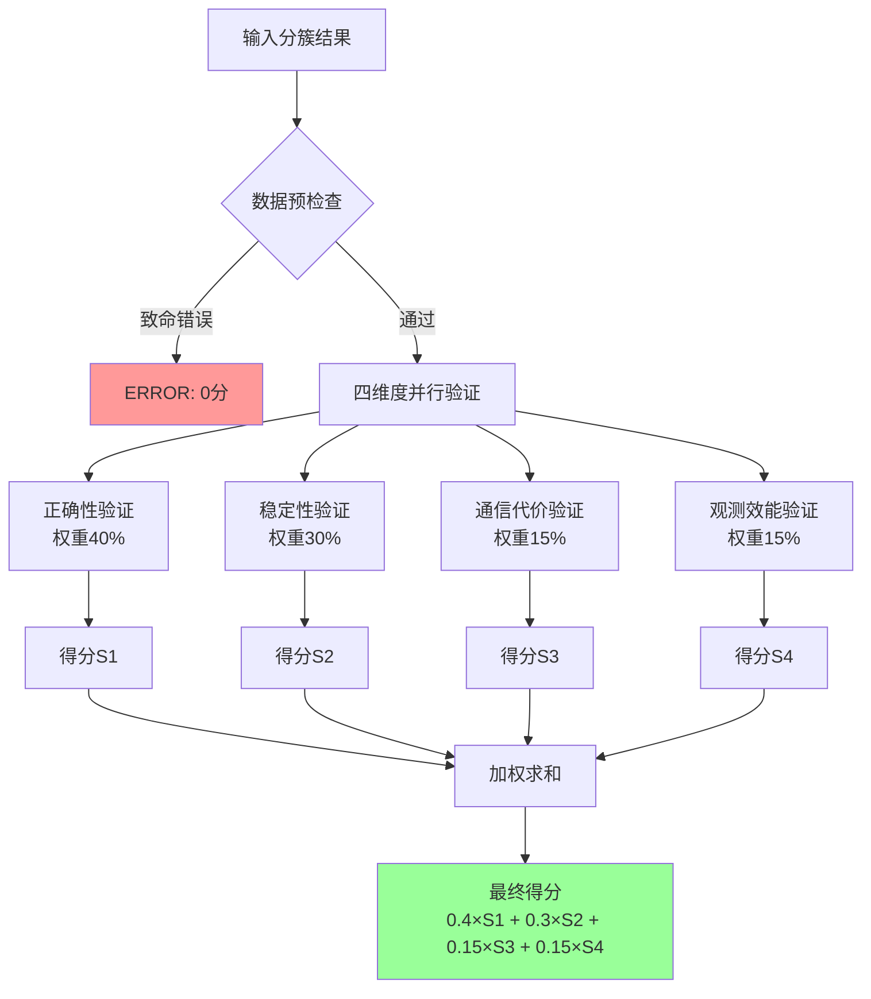

---

## 2. 详细验证项说明

本章节详细描述了对一个基本有效（即未触发任何致命错误）的分簇方案，如何从四个维度进行量化评分。

### 2.1 正确性与隔离性验证 (Correctness and Isolation Validation)

- **权重: 40%**
- **目标:** 此项验证是确保分簇结果合法性的基石。它检查模型输出是否遵循了最基本的物理和逻辑约束，是所有后续评估的前提。

#### 2.1.1 检查项

1.  **致命错误检测 (Fatal Error Check):**
    *   **规则:** 分簇结果中出现的所有卫星（Satellite）和目标（Target）ID，必须存在于当前时间切片的输入数据中。
    *   **描述:** 这是最严格的检查。如果模型"幻想"出不存在的实体，则整个分簇方案无效。
    *   **评分:** 一旦检测到任何一个不存在的卫星或目标，此项验证**直接得0分**，并标记为 `[ERROR]`。

2.  **目标覆盖度检测 (Target Coverage Check):**
    *   **规则:** 输入数据中定义的所有目标，必须被分配到至少一个簇中。
    *   **描述:** 衡量分簇方案是否完整地解决了观测任务。遗漏目标意味着任务失败。
    *   **评分:** 此项最多扣 **50分**。扣分与遗漏目标的比例成正比。例如，遗漏10%的目标将扣除 `10% * 50 = 5` 分。

3.  **隔离性验证 (Isolation Validation):**
    *   **规则:** 确保簇与簇之间是严格隔离的，不存在成员或连接的交叉。
    *   **描述:** 这是分簇的核心原则。一个实体只能属于一个簇，一个有效的观测连接也必须在簇内完成。
    *   **评分:** 此项最多扣 **50分**，由以下两部分构成：
        *   **多簇归属 (Multi-Cluster Membership):**
            *   **规则:** 同一个卫星或目标不能同时出现在多个簇中。
            *   **评分:** 最多扣 **25分**。根据出现多簇归属的卫星和目标数量进行扣分，每个违规实体扣除固定分数（如5分），直到25分上限。
        *   **连接跨簇 (Cross-Cluster Connection):**
            *   **规则:** 如果输入数据显示卫星A可以观测目标B，而模型将卫星A和目标B划分到不同的簇中，则视为一次"跨簇连接"违规。
            *   **评分:** 最多扣 **25分**。扣分与违规连接占总有效连接的比例成正比。

---

### 2.2 分簇稳定性验证 (Cluster Stability Validation)

- **权重: 30%**
- **目标:** 评估分簇结果在时间维度上的平滑过渡能力。频繁且不必要的簇成员变动会增加系统的不确定性和控制成本。

#### 2.2.1 核心设计理念：基于连接关系的切换检测

传统的稳定性验证方法简单地通过比较前后时间切片中实体的簇ID来判断是否发生切换，这种方法存在**根本性缺陷**：簇ID的变化并不等同于实际的连接关系变化。例如，当一个簇因为新卫星的加入而扩展时，簇内原有成员的工作关系并未改变，不应被视为不稳定。

**我们的创新方法**采用**基于连接关系的切换检测**，通过分析实体间的"伙伴关系"变化来准确识别真正的稳定性问题：

- **目标的伙伴关系**: 目标T在某个簇中的伙伴是所有与它在同一簇中、能够观测它的卫星集合
- **卫星的伙伴关系**: 卫星S在某个簇中的伙伴是所有与它在同一簇中的其他卫星集合（排除自己）

只有当实体的**有效连接关系**发生不合理变化时，才被认定为稳定性问题。

#### 2.2.1.1 连接关系映射可视化

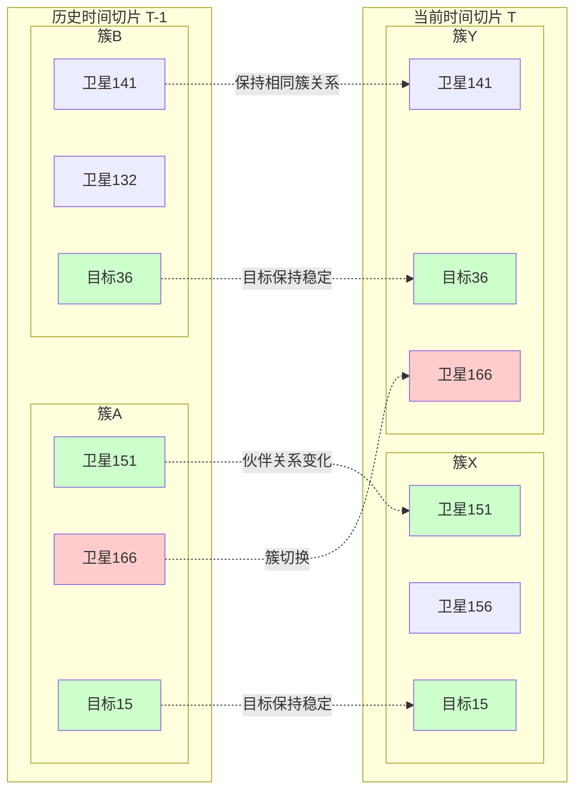

#### 2.2.2 检查项详解

**前提:** 此项验证需要前一时间切片的分簇结果作为历史数据。若无历史数据，则跳过验证，直接给予满分100分。

##### 1. 目标稳定性验证 (Target Stability) - 最多扣50分

**核心算法:**
```
对于每个目标 T:
1. 获取历史伙伴卫星集合: last_companions = {与T同簇的卫星}
2. 获取当前伙伴卫星集合: current_companions = {与T同簇的卫星}
3. 获取当前可见卫星集合: visible_sats = {当前时间切片中能观测T的卫星}
4. 计算丢失的可见伙伴: lost_visible = (last_companions ∩ visible_sats) - current_companions
5. 如果 lost_visible ≠ ∅，则认定为不合理切换
```

**扣分策略:**
- **主要因子**: 丢失的可见伙伴卫星总数 × 5分/个
- **次要因子**: 目标切换率 × 20分  
- **总惩罚**: min(主要因子 + 次要因子, 50分)

**设计思想**: 优先惩罚"卫星丢失"的严重程度，而非简单的切换频率。丢失更多观测资源的切换应受到更重的惩罚。

**智能区分**:
- **真正的切换**: 有卫星本来可以观测目标T，但被分配到其他簇
- **合理的调整**: 移除不可见卫星，增加新的可见卫星（簇扩展/收缩）

##### 1.1 目标稳定性验证流程图

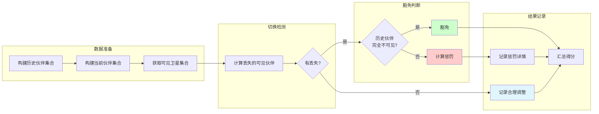

##### 2. 卫星稳定性验证 (Satellite Stability) - 最多扣30分

**核心算法:**
```
对于每个卫星 S:
1. 获取历史伙伴卫星集合: last_companions = {与S同簇的其他卫星}
2. 获取当前伙伴卫星集合: current_companions = {与S同簇的其他卫星}
3. 计算伙伴交集: intersection = last_companions ∩ current_companions
4. 如果 intersection = ∅ 且 |last_companions| > 0 且 |current_companions| > 0，则检查豁免条件
5. 若不满足豁免条件，认定为不合理切换
```

**豁免条件检查:**
```
获取当前连通卫星集合: connected_sats = {与S有通信链路的卫星}
如果 last_companions ∩ connected_sats = ∅，则豁免（卫星在原簇已成孤岛）
```

**重复惩罚避免**: 如果卫星已在目标稳定性验证中被惩罚，则跳过以避免重复扣分。

**扣分策略**: 卫星切换率 × 100分，最多30分

##### 2.1 卫星稳定性验证流程图

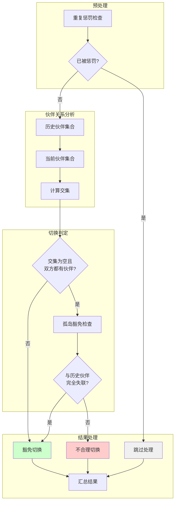

##### 3. Jaccard相似度验证 (Jaccard Similarity) - 最多扣20分

**算法流程:**
```
1. 计算每对对应簇的Jaccard相似度: J = |A∩B| / |A∪B|
2. 计算平均相似度: avg_jaccard = Σ(J_i) / n
3. 如果 avg_jaccard < 0.8，检查惩罚缩放条件
4. 惩罚缩放 = 不合理切换数量 / 总切换数量
5. 最终惩罚 = 基础惩罚 × 惩罚缩放
```

##### 3.1 Jaccard相似度验证流程图

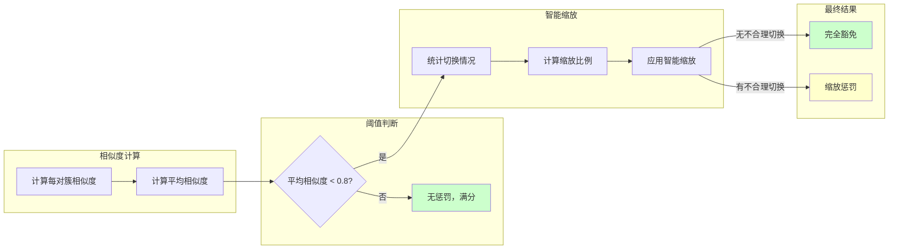

#### 2.2.3 豁免机制：智能区分"抖动"与"自适应调整"

稳定性验证的精髓在于区分**破坏性的、无意义的"抖动"**（Instability/Jitter）和**由环境变化驱动的、必要的"自适应调整"**（Adaptive Adjustment）。

#### 2.2.3.1 豁免决策树

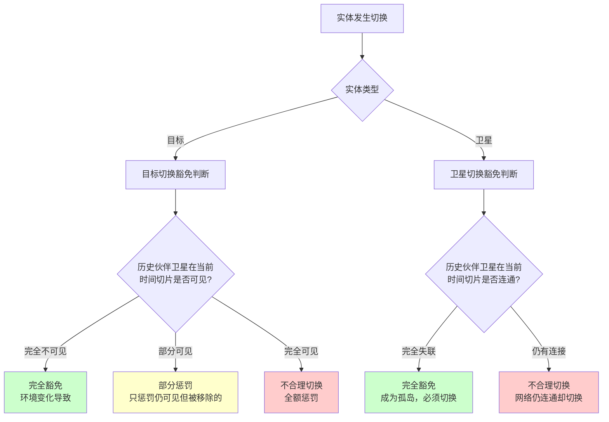

##### 1. 目标切换豁免机制

**豁免原则**: 基于物理可见性的智能判断
- **完全豁免**: 目标的历史伙伴卫星在当前时间切片中完全不可见
- **部分惩罚**: 仅对仍可见但被移除的伙伴卫星进行惩罚
- **合理调整识别**: 区分"移除不可见卫星+增加新卫星"与"移除可见卫星"

**实现细节**:
```python
# 筛选出在当前时间切片中仍然可见的历史伙伴卫星
still_visible_last_companions = last_companions & visible_sats_for_target

# 只有当存在"本来可见但被移除"的卫星时，才认为是不合理的切换
lost_visible_companions = still_visible_last_companions - current_companions

if len(lost_visible_companions) > 0:
    # 不合理切换，进行惩罚
else:
    # 合理调整，记录但不扣分
```

##### 2. 卫星切换豁免机制

**豁免原则**: 基于网络拓扑的连通性分析
- **孤岛豁免**: 卫星与原簇所有成员失去通信连接时，切换被豁免
- **网络完整性维护**: 优先保证通信网络的连通性而非简单的成员稳定性

**实现细节**:
```python
# 检查豁免条件：卫星是否在原簇已成孤岛
connected_sats = sat_connectivity.get(satellite, set())

# 如果卫星在当前时间切片，与旧伙伴卫星已无任何连接
if not last_companions.intersection(connected_sats):
    justified_satellite_switches += 1  # 豁免切换
    continue  # 跳过，不计入惩罚
```

##### 3. 重复惩罚避免机制

**问题**: 同一个切换事件可能在多个维度被重复惩罚
**解决方案**: 建立惩罚记录，确保同一卫星的同一次切换只被惩罚一次

```python
# 收集已经因为目标切换而被惩罚的卫星
satellites_penalized_for_targets = set()
for switch in target_switches:
    lost_sats = switch.get('lost_visible_companions', set())
    satellites_penalized_for_targets.update(lost_sats)

# 在卫星稳定性验证中跳过已惩罚的卫星
if satellite in satellites_penalized_for_targets:
    continue  # 跳过，避免重复惩罚
```

##### 4. Jaccard相似度的智能缩放

**创新设计**: Jaccard相似度惩罚与实际不合理切换的比例挂钩

```python
unjustified_switches = target_switch_count + satellite_switch_count
total_switches = unjustified_switches + justified_target_switches + justified_satellite_switches

if unjustified_switches > 0 and total_switches > 0:
    # 根据不合理切换的比例来缩放惩罚
    unjustified_ratio = unjustified_switches / total_switches
    jaccard_penalty = potential_jaccard_penalty * unjustified_ratio
elif unjustified_switches == 0:
    # 所有切换都是合理的，Jaccard惩罚完全豁免
    jaccard_penalty = 0
```

##### 4.1 智能缩放机制示意图

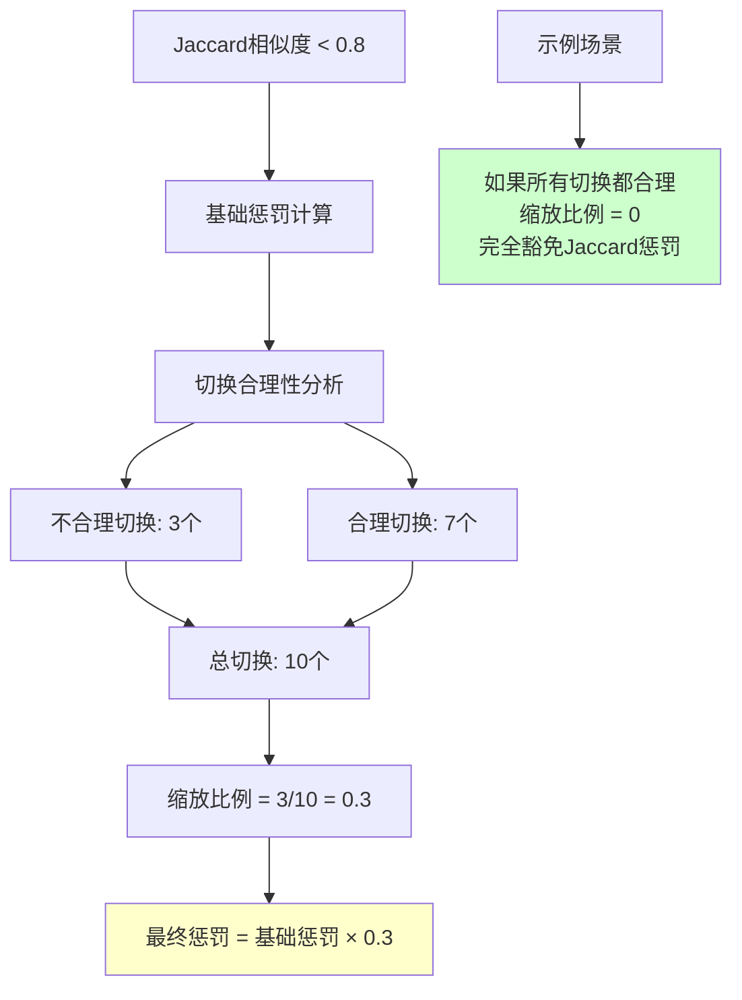

#### 2.2.4 信息记录与可解释性

验证系统提供详细的执行日志，确保每个决策都可追溯：

**调整信息记录**:
```
[INFO] 目标123簇调整：增加卫星{456, 789}, 移除不可见卫星{321}
[INFO] 卫星456簇调整：增加伙伴{789}, 移除伙伴{123}
```

**豁免信息记录**:
```
[INFO] 卫星456切换被豁免：与原伙伴卫星{123, 789}已无连接
[INFO] 卫星789切换不重复扣分：已在目标切换中惩罚
```

**警告信息记录**:
```
[WARNING] 目标切换2个，丢失3个可见伙伴，扣15.0分：目标123(丢失可见伙伴{456}); 目标789(丢失可见伙伴{321, 654})
```

通过这套先进的稳定性验证体系，我们实现了对分簇稳定性的**语义级理解**，能够准确区分有害的随意变动和有益的自适应调整，为大语言模型的分簇质量提供了更加精确和公正的评估。

#### 2.2.5 验证系统交互序列图

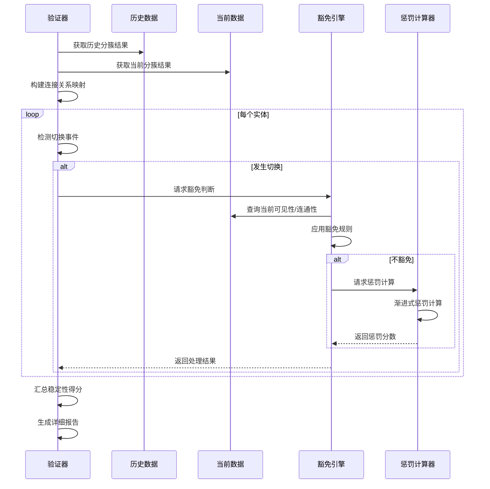

---

### 2.3 通信代价验证 (Communication Cost Validation)

- **权重: 15%**
- **目标:** 评估分簇方案的网络效率。一个好的分簇方案应显著降低维持网络同步所需的总通信距离（成本）。

#### 2.3.1 检查项

1.  **致命错误检测 (Fatal Error Check):**
    *   **规则:**
        1.  每个簇必须指定一个主节点（Master Satellite），且该主节点必须是该簇的成员。
        2.  簇内的所有卫星必须能够通过一条或多条路径与主节点通信（即网络必须是连通的，不能有"孤星"）。
    *   **描述:** 主节点是簇的控制核心，其有效性和网络的连通性是通信的基础。
    *   **评分:** 一旦检测到主节点无效或存在孤星，此项验证**直接得0分**，并标记为 `[ERROR]`。

2.  **通信代价评估 (Cost Evaluation):**
    *   **规则:** 计算分簇后的总通信代价，并与"未分簇"（即全星座网络）的基准代价进行比较。
    *   **描述:** 总通信代价由两部分组成：
        *   **簇内同步代价 (Intra-cluster Cost):** 簇内所有成员卫星到其主节点的最短路径距离之和。
        *   **全网同步代价 (Inter-cluster Cost):** 所有主节点之间的最短路径距离之和。
    *   **评分:** 最多扣 **100分**。扣分基于"代价比例"（`总通信代价 / 全星座基准代价`）。此比例越高，说明分簇带来的通信效率提升越小，扣分越多。当代价比例低于一个理想阈值（如10%）时，不扣分。

#### 2.3.2 通信代价计算流程图

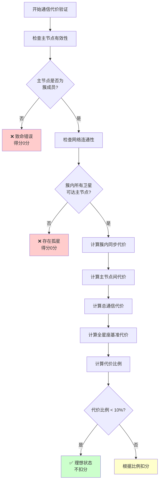

---

### 2.4 观测效能验证 (Observation Efficiency Validation)

- **权重: 15%**
- **目标:** 评估分簇方案在完成核心观测任务上的质量和可靠性。

#### 2.4.1 检查项

1.  **致命错误检测 (Fatal Error Check):**
    *   **规则:** 如果一个目标被分配到了某个簇，那么该簇内必须至少有一颗卫星能够实际观测到该目标。
    *   **描述:** 将目标分配给一个无法观测它的簇是严重的逻辑错误，意味着该目标实际上被遗漏了。
    *   **评分:** 一旦检测到此类情况，此项验证**直接得0分**，并标记为 `[ERROR]`。

2.  **观测重数评估 (Observation Multiplicity Evaluation):**
    *   **规则:** 计算每个目标的"观测重数"，即在它所属的簇内，有多少颗卫星能同时看到它。
    *   **描述:** 观测重数是衡量观测可靠性的关键指标。重数越高，表示对该目标的观测越稳健，抗干扰能力越强。
    *   **评分:** 最多扣 **100分**。评分基于所有簇的"平均观测重数"。
        *   平均重数 ≥ 2.5: **满分100分** (理想状态)
        *   平均重数 ≤ 1.0: **0分** (及格线以下)
        *   在 (1.0, 2.5) 区间内，分数呈线性增长。

#### 2.4.2 观测效能评估流程图

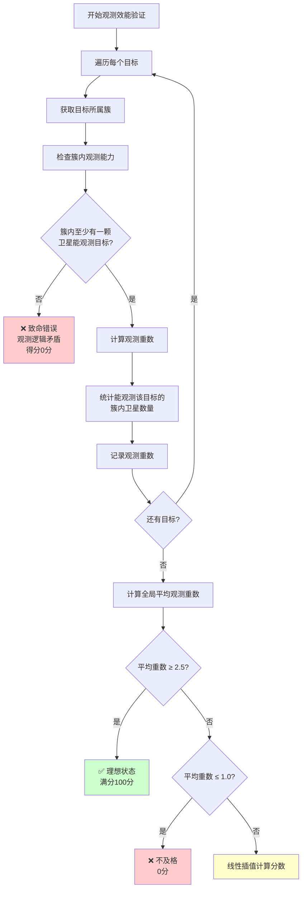

---

## 3. 致命错误 (Fatal Errors) 验证：一票否决制

在四维评估体系之上，验证器建立了一套严格的**"一票否决"**机制，用于检测致命的、不可容忍的逻辑错误。这些错误一旦发生，意味着模型生成的分簇方案在根本上是无效的，无法用于实际场景。

任何致命错误的触发，都会导致其所属的验证维度**直接被评为0分**，从而对总分产生重大影响。这种设计确保了模型必须首先学会遵守最基本的规则，然后才能在稳定性、成本、效能等高级目标上进行优化。

### 3.1 致命错误处理流程图

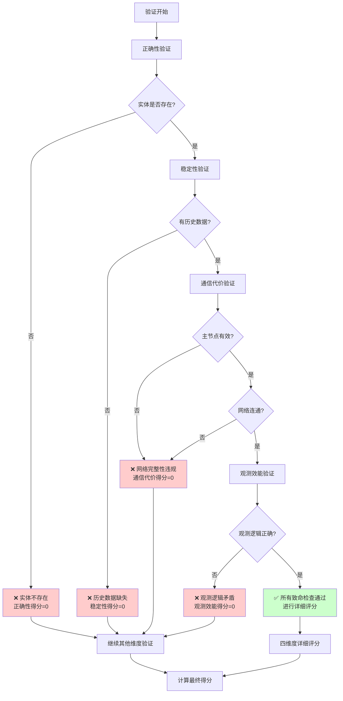

### 3.1 致命错误清单

1.  **实体不存在 (Entity Non-existence):**
    *   **所属维度:** 正确性与隔离性验证
    *   **规则:** 分簇结果中出现的所有卫星和目标ID，必须存在于当前时间切片的输入数据中。
    *   **阐述:** 这是对模型"幻觉"的零容忍策略。任何凭空捏造的实体都会使分簇方案立即失效。

2.  **历史数据缺失 (Missing History Data):**
    *   **所属维度:** 分簇稳定性验证
    *   **规则:** 当进行稳定性评估时，必须提供前一时间切片的分簇结果。
    *   **阐述:** 稳定性是基于时间连续性的评估，缺少历史数据则评估无法进行。这通常是数据准备阶段的错误，但验证器会将其捕获并标记为致命错误。

3.  **网络完整性被破坏 (Network Integrity Violation):**
    *   **所属维度:** 通信代价验证
    *   **规则:**
        1.  每个簇必须指定一个主节点，且该主节点必须是该簇的成员。
        2.  簇内的所有卫星必须能够通过一条或多条路径与主节点通信（即网络必须是连通的，不能有"孤星"）。
    *   **阐述:** 主节点是簇的控制核心，网络的连通性是协同工作的基础。违反此规则意味着分簇在物理上不可行。

4.  **观测逻辑矛盾 (Observation Logic Contradiction):**
    *   **所属维度:** 观测效能验证
    *   **规则:** 如果一个目标被分配到了某个簇，那么该簇内必须至少有一颗卫星能够实际观测到该目标。
    *   **阐述:** 将目标分配给一个无法观测它的簇是严重的逻辑错误，意味着该目标实际上被遗漏了，任务并未完成。

---
## 4. 综合评估与统计分析引擎

除了对单个分簇结果进行精确的四维度验证外，本验证器的另一大核心优势在于其内置的**综合评估与统计分析引擎**。该引擎能够处理整个验证数据集的结果，从宏观视角提供对大语言模型性能的深度洞察，帮助开发者快速定位模型的系统性优势与短板。

### 4.1 核心分析功能

1.  **宏观性能快照 (Macro Performance Snapshot):**
    *   **功能:** 自动计算并展示数据集的**平均分、最高/最低分、满分率**等关键指标。
    *   **优势:** 让开发者在数秒内对模型的整体性能水平有一个直观、量化的认识。

2.  **分数分布直方图 (Score Distribution Histogram):**
    *   **功能:** 将所有样本的最终得分划分到不同的分数区间（如 "90-100", "80-89" 等），并统计每个区间的样本数量和百分比。
    *   **优势:** 揭示模型性能的**一致性**。例如，一个平均分为75分的模型，其得分是稳定在70-80分区间，还是呈现出"两极分化"（大量满分样本和大量低分样本并存）？这种分布信息对于判断模型的可靠性至关重要。

3.  **多维度能力剖析 (Multi-dimensional Capability Profiling):**
    *   **功能:** 分别统计**正确性、稳定性、通信代价、观测效能**这四个维度的平均分、丢分率和分数范围。
    *   **优势:** 这相当于为模型生成了一张"能力雷达图"。开发者可以清晰地看到模型是"全能型选手"还是"偏科生"。例如，模型可能在"正确性"上表现完美，但在"稳定性"上频繁丢分。这种剖析为模型的针对性优化指明了方向。

4.  **根本原因分析 (Root Cause Analysis):**
    *   **功能:** 自动聚合所有样本的丢分项，并按**验证类型**和**具体原因**进行分类、计数和排序。
    *   **优势:** 这是整个分析引擎中最具价值的部分。它能直接回答"模型主要错在哪里？"这个问题。例如，报告可能会指出"最常见的丢分类型是'分簇稳定性'，其中'目标切换过于频繁'出现了35次"。这种精确到具体错误类型的统计，极大地提升了模型迭代和调试的效率。

### 4.2 统计分析引擎架构图

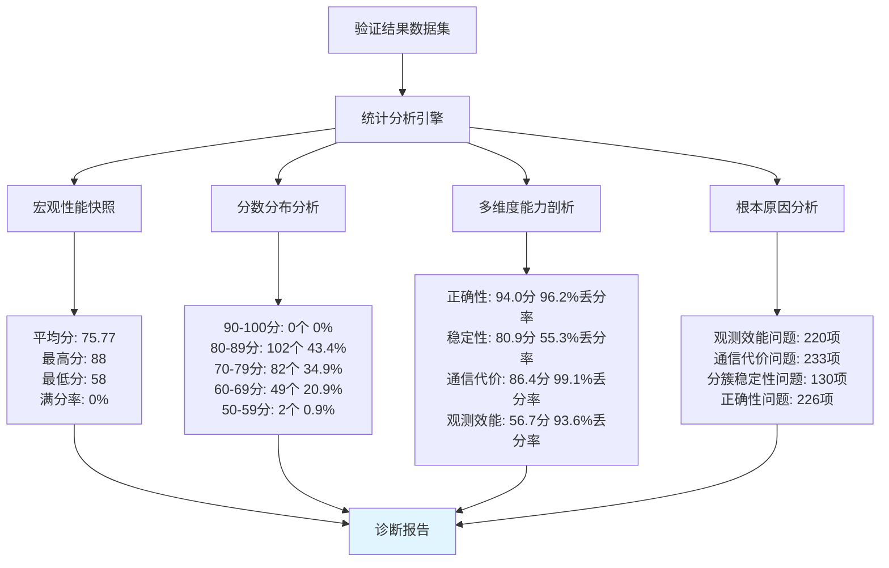

### 4.2 设计优势总结

该统计分析引擎将验证器从一个简单的"裁判"提升为了一个智能的"诊断分析师"。它通过自动化的数据聚合与模式挖掘，将繁琐的日志分析工作转变为一份清晰、直观、可执行的诊断报告，充分体现了该验证器在实用性和深度分析方面的设计巧思。

---
## 5. 总结

该验证体系通过全面、多维度的量化评估，能够系统地检验大模型生成卫星分簇结果的质量。它不仅关注结果的正确性，更深入到稳定性、经济性和任务效能等高级维度，为模型的迭代优化提供了清晰、可量化的指导。

特别是在**分簇稳定性验证**方面，我们实现了从传统的"簇ID比较"到"连接关系分析"的根本性突破，通过精心设计的豁免机制和重复惩罚避免策略，确保验证系统能够智能地区分有害的随意变动和有益的自适应调整，为大语言模型提供更加公正和精确的评估标准。
